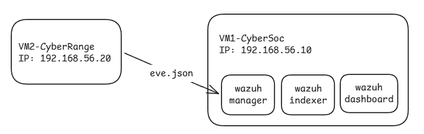
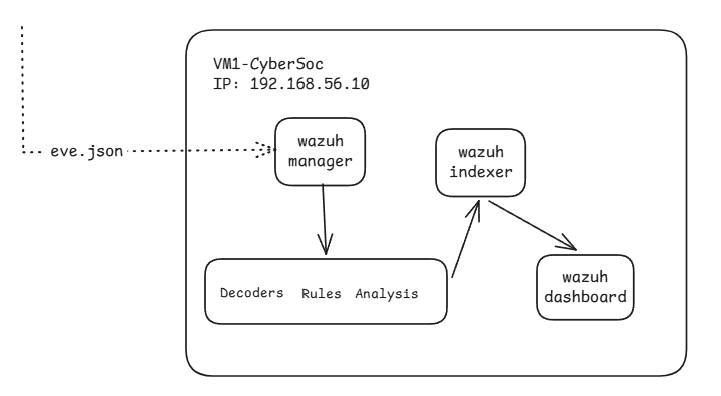

# :shield: Wazuh

**Wazuh** es la plataforma central de seguridad utilizada en nuestro lab para **recibir, analizar y generar alertas a partir de diferentes fuentes de información**.

En nuestro entorno, Wazuh conecta las detecciones de red con la información de Threat Intelligence y la evidencia obtenida del host.

---

## :dart: ¿Dónde está Wazuh?

Nuestro laboratorio utiliza:

```text
VM1 — CyberSOC
192.168.56.10
```

ahi es donde se encuentra el **Wazuh Manager, Indexer y Dashboard**.

El Agent recopila información de VM2 y la envía al Manager.



---

## :link: Arquitectura básica

El flujo principal de Wazuh es:



### :computer: Agent

El **Agent** recopila eventos del sistema donde está instalado.

En nuestro laboratorio, el Agent está en:

```text
VM2 — CyberRange
192.168.56.20
```

Por ejemplo, puede recoger los eventos generados por:

```text
Suricata
FIM
YARA
```

---

### :brain: Manager

El **Manager** es el componente que recibe y analiza los eventos.

Aquí se encuentran elementos importantes como:

* **Decoders** → interpretan y estructuran los eventos.
* **Rules** → determinan cuándo un evento cumple determinadas condiciones.
* **Analysis** → procesa los eventos y genera alertas.

---

### :file_folder: Indexer

El **Indexer** almacena e indexa los datos para poder buscarlos y consultarlos.

```text
Manager
   ↓
Indexer
   ↓
Datos indexados
```

---

### :bar_chart: Dashboard

El **Dashboard** proporciona la interfaz desde la que podemos consultar y visualizar los datos procesados por Wazuh.

```text
Indexer
   ↓
Dashboard
   ↓
Analista
```

---

# :link: Wazuh dentro de nuestro laboratorio

Wazuh recibe información de diferentes mecanismos:

```text
                 CyberRange
                     │
        ┌────────────┼────────────┐
        │            │            │
        ▼            ▼            ▼
    Suricata        FIM          YARA
        │            │            │
        └────────────┼────────────┘
                     ▼
                Wazuh Agent
                     │
                     ▼
                Wazuh Manager
                     │
              ┌──────┴──────┐
              │             │
              ▼             ▼
       Rules / Analysis   TI / CDB
              │             │
              └──────┬──────┘
                     ▼
                  Alertas
                     │
                     ▼
             Indexer / Dashboard
```

Cada mecanismo aporta información diferente:

```text
Suricata → actividad de red
FIM      → cambios en archivos
YARA     → coincidencias de patrones
TI       → contexto sobre IOCs
```

Wazuh permite centralizar y procesar estas evidencias.

---

## :warning: Evento ≠ alerta

Es importante distinguir ambos conceptos.

Un **evento** es información sobre algo que ocurrió.

Una **alerta** aparece cuando Wazuh procesa un evento y este cumple con alguna regla definida.

saber diferencia: 

```text
eve.json ≠ alerta de Wazuh
```

`eve.json` es la salida de eventos de Suricata.

---

## :brain: Lo esencial

Para este laboratorio debemos recordar:

* **Agent** → recopila eventos.
* **Manager** → recibe, decodifica, analiza y aplica reglas.
* **Indexer** → indexa y almacena los datos.
* **Dashboard** → permite consultar y visualizar la información.
* **Rules** → determinan cuándo un evento genera una alerta.
* **Decoders** → estructuran la información recibida.
* Wazuh **no reemplaza a Suricata, FIM o YARA**; procesa la información que estos mecanismos generan.