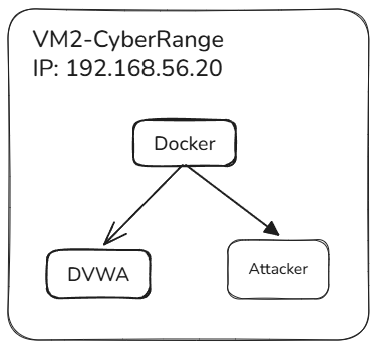
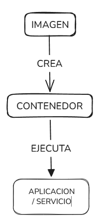
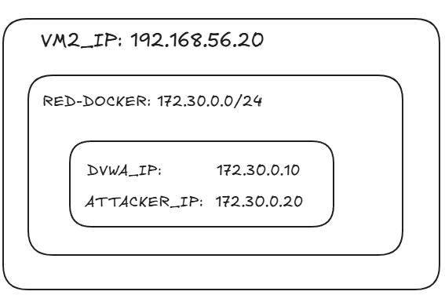
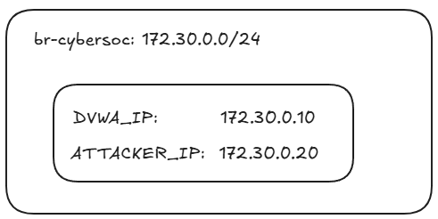
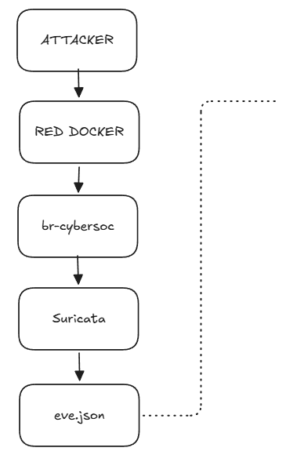
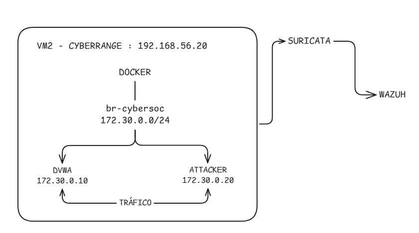

# :whale: Docker
Usaremos docker para desplegar y conectar los componentes del **CyberRange** dentro de un entorno controlado.

Función principal en este proyecto es proporcionar **contenedores, servicios y conectividad de red** sobre estos se generan eventos que posteriormente seran analizados por las herramientas del SOC.

---

## :dart: ¿Por qué usamos Docker?

En **VM2 — CyberRange**, se necesita un entorno sobre el cual se genera trafico y actividades controladas.

Docker nos facilita ejecutar los componentes del laboratorio como containers sin tener que instalar cada servicio directamente sobre el sistema operativo de la VM.

En nuestro caso:


Docker proporciona el entorno donde se ejecutan estos componentes.

---

# :books: Conceptos mínimos de Docker

Para comprender el laboratorio es necesario conocer estos conceptos:

| Concepto                                     | Qué representa                                               |
| -------------------------------------------- | ------------------------------------------------------------ |
| :card_file_box: **Imagen**                   | Plantilla utilizada para crear un contenedor                 |
| :whale: **Contenedor**                       | Instancia ejecutable de una imagen                           |
| :globe_with_meridians: **Network**           | Red que permite comunicar contenedores                       |
| :bridge_at_night: **Bridge**                 | Tipo de red Docker que conecta contenedores                  |
| :electric_plug: **Puerto**                   | Punto de comunicación de un servicio                         |
| :floppy_disk: **Volumen**                    | Almacenamiento persistente asociado a contenedores           |
| :arrows_counterclockwise: **Docker Compose** | Permite definir y administrar varios servicios conjuntamente |

Estos conceptos son suficientes para comprender la infraestructura utilizada.

---

# :whale: Imagen y contenedor

La diferencia fundamental es:



Nuestro laboratorio, la imagen usada para crear contenedores que proporcionan servicios como **DVWA** o el entorno **Attacker**.

Lo podemos ver como:

> **Imagen = plantilla**
> **Contenedor = instancia ejecutándose**

---

# :globe_with_meridians: Docker Network

Los contenedores necesitan una red para comunicarse.

Nuestro CyberRange utiliza:

```text
172.30.0.0/24
```

Dentro de esta red tenemos:



Esto permite que el atacante genere tráfico hacia DVWA.

---

# :bridge_at_night: `br-cybersoc`

La red Docker está asociada al bridge:

```text
br-cybersoc
```

Podemos visualizarlo conceptualmente:



>[!IMPORTANT]
>**Suricata necesita observar el tráfico generado dentro de este entorno**.

---

# :satellite: Docker + Suricata

Docker genera el entorno donde se produce el tráfico que circula por la infraestructura de red Docker asociada al laboratorio.

Suricata inspecciona ese tráfico:


Por lo tanto:

```text
Docker    → proporciona el entorno y la conectividad
Suricata  → inspecciona el tráfico
Wazuh     → procesa y analiza los eventos
```

---

# :computer: VM y Docker

Es importante distinguir las dos capas de virtualización utilizadas en el laboratorio.

Tenemos entonces:

* `192.168.56.20` → dirección de **VM2**.
* `172.30.0.10` → dirección del **contenedor DVWA**.
* `172.30.0.20` → dirección del **contenedor Attacker**.

Son direcciones de redes diferentes.

---

# :arrows_counterclockwise: Docker Compose

Cuando un laboratorio utiliza varios contenedores, Docker Compose permite definirlos y administrarlos como un conjunto de servicios.

Conceptualmente:

```text
docker-compose.yml
        │
        ├── DVWA
        ├── Attacker
        └── Network
```

En lugar de configurar cada componente manualmente, Compose permite definir la infraestructura necesaria en un archivo de configuración.

comandos de docker del lab:

```bash
docker compose up
```

para iniciar los servicios definidos.

```bash
docker compose ps
```

para comprobar el estado de los servicios.

---

# :mag: Comandos mínimos que debemos reconocer

### Ver contenedores

```bash
docker ps
```

Muestra los contenedores que están ejecutándose.

```bash
docker ps -a
```

Muestra contenedores ejecutándose y detenidos.

### Ver imágenes

```bash
docker images
```

Muestra las imágenes disponibles.

### Ver redes

```bash
docker network ls
```

Muestra las redes Docker existentes.

### Inspeccionar una red

```bash
docker network inspect <network>
```

Permite consultar información de una red, incluyendo los contenedores conectados y sus direcciones IP.

### Inspeccionar un contenedor

```bash
docker inspect <container>
```

Permite consultar información detallada de un contenedor.

---

# :link: Relación con nuestro laboratorio

docker en el proyecto: 


---

# :brain: Lo que debemos saber antes de continuar

Para este laboratorio, debemos poder responder:

* :globe_with_meridians: ¿Qué es una Docker Network?
* :bridge_at_night: ¿Qué función cumple `br-cybersoc`?
* :computer: ¿Por qué `192.168.56.20` y `172.30.0.10` pertenecen a redes diferentes?
* :satellite: ¿Por qué el tráfico entre Attacker y DVWA es relevante para Suricata?
* :arrows_counterclockwise: ¿Para qué utilizamos Docker Compose?
* :mag: ¿Qué información podemos obtener con `docker ps` y `docker network inspect`?
