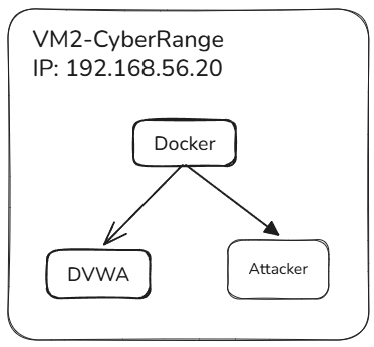
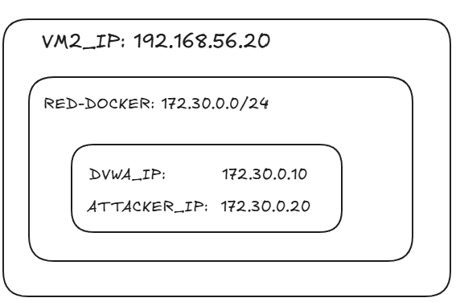
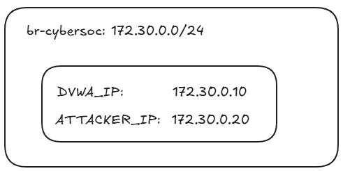
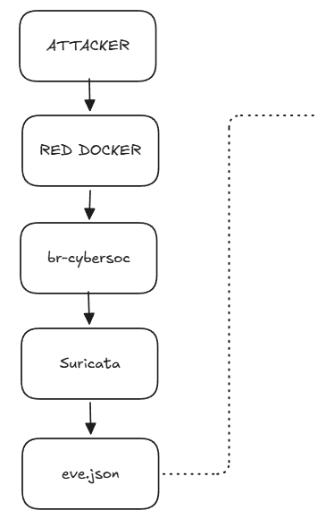

# :whale: Docker
Usaremos docker para desplegar y conectar los componentes del **CyberRange** dentro de un entorno controlado.

Función principal de proporcionar **contenedores, servicios y conectividad de red**, sobre estos se generan eventos que posteriormente seran analizados.

---

## :dart: ¿Por qué Docker?

Nos facilita ejecutar los componentes del laboratorio sin tener que instalar cada servicio sobre el sistema operativo de la VM2.

En nuestro caso:


---

# :books: Conceptos mínimos de Docker

Para comprender el laboratorio es necesario conocer estos conceptos:

| Concepto                                     | Qué representa                                               |
| -------------------------------------------- | ------------------------------------------------------------ |
| :card_file_box: **Imagen**                   | Plantilla utilizada para crear un contenedor                 |
| :whale: **Contenedor**                       | Instancia ejecutable de una imagen                           |
| :globe_with_meridians: **Network**           | Red que permite comunicar contenedores                       |
| :bridge_at_night: **Bridge**                 | Tipo de red Docker que conecta contenedores                  |
| :electric_plug: **Puerto**                   | Punto de comunicación de un servicio                         |
| :floppy_disk: **Volumen**                    | Almacenamiento persistente asociado a contenedores           |
| :arrows_counterclockwise: **Docker Compose** | Permite definir y administrar varios servicios conjuntamente |

Estos conceptos son suficientes para comprender la infraestructura utilizada.

---

> **Imagen = plantilla**
> **Contenedor = instancia ejecutándose**

---

# :globe_with_meridians: Docker Network

Los contenedores necesitan una red para comunicarse.

Nuestro CyberRange usa:

```text
172.30.0.0/24
```

Dentro de esta red tenemos:



Permitiendo a nuestro atacante generar trafico sobre DVWA.

---

# :bridge_at_night: `br-cybersoc`

La red Docker está asociada al bridge:

```text
br-cybersoc
```

Podemos visualizarlo conceptualmente:



>[!IMPORTANT]
>**Suricata necesita observar el tráfico generado dentro de este entorno**.

---

# :satellite: Docker + Suricata

Suricata inspecciona el trafico que circula por la red docker del lab:


Por lo tanto:

```text
Docker    → proporciona el entorno y la conectividad
Suricata  → inspecciona el tráfico
Wazuh     → procesa y analiza los eventos
```

---

# :computer: VM y Docker

Tenemos que diferenciar las dos redes que tenemos en VM2, nos queda:

* `192.168.56.20` → dirección de **VM2**.
* `172.30.0.10` → dirección del **contenedor DVWA**.
* `172.30.0.20` → dirección del **contenedor Attacker**.

Son direcciones de redes diferentes.

---

# :arrows_counterclockwise: Docker Compose

Cuando un laboratorio utiliza varios contenedores, Docker Compose permite definirlos y administrarlos como un conjunto de servicios.

Conceptualmente:

```text
docker-compose.yml
        │
        ├── DVWA
        ├── Attacker
        └── Network
```
Compose permite definir la infraestructura necesaria en un archivo de configuración, no se hace manualmente.

comandos de docker que usaremos:

```bash
docker compose up
# para iniciar los servicios definidos.
docker compose ps
#para comprobar el estado de los servicios.
```
---

# :mag: Comandos basicos que debemos reconocer

### Para contenedores

```bash
docker ps
#Muestra los contenedores que están ejecutándose.

docker ps -a
#Muestra contenedores ejecutándose y detenidos.
```


### Para imágenes

```bash
docker images
#Muestra las imágenes disponibles.
```

### Para redes

```bash
docker network ls
#Muestra las redes Docker existentes.
```

---

# :link: Docker en nuestro laboratorio

docker en el proyecto: 


---

# :brain: Lo que debemos saber antes de continuar