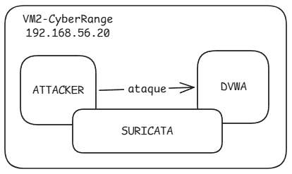
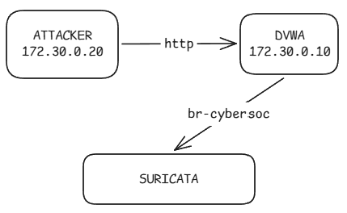

# :satellite: Suricata

**Suricata** es un motor de detección de intrusiones de red (**NIDS**)  analiza tráfico de red y genera eventos cuando este coincide con reglas de detección.

Lo usamos para detectar tráfico HTTP entre el contenedor **Attacker** y **DVWA**.

---

## :dart: ¿Dónde está Suricata?

Suricata se ejecuta directamente en **VM2 — CyberRange**:



Los contenedores utilizan la red:

```text
172.30.0.0/24
```

con:

```text
DVWA      → 172.30.0.10
Attacker  → 172.30.0.20
```

Suricata inspecciona la interfaz Docker:

```text
br-cybersoc
```

---

## :mag: ¿Qué hace en nuestro laboratorio?

El flujo principal es:



La regla local del laboratorio detecta solicitudes HTTP hacia:

```text
/login.php
```

y utiliza el **SID `1000001`**.

Por ejemplo:

```text
CYBERSOC - Acceso HTTP a DVWA
```

---

## :shield: Suricata dentro del laboratorio

Suricata se encarga de la **detección de red**.

Su funcion es la de:

> **Observar el tráfico de red en CyberRange, detectar coincidencias con reglas y generar eventos que serán procesados por Wazuh.**

---

## :brain: Recordar

* Suricata = **NIDS**.
* Se ejecuta en **VM2 (`192.168.56.20`)**.
* Inspecciona `br-cybersoc`.
* La red del laboratorio es `172.30.0.0/24`.
* Attacker = `172.30.0.20`.
* DVWA = `172.30.0.10`.
* La regla principal utiliza **SID `1000001`**.
* Los eventos se escriben en `/var/log/suricata/eve.json`.
* Wazuh Agent recoge `eve.json` y lo envía al Manager.