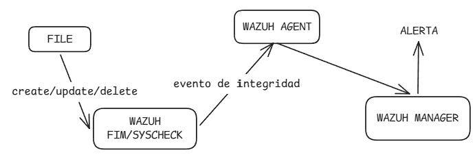

# :page_facing_up: File Integrity Monitoring (FIM)

**FIM (File Integrity Monitoring)** es un mecanismo que detecta cambios en archivos y directorios monitoreados.

En nuestro laboratorio, FIM es implementado por **Wazuh mediante Syscheck** y se utiliza para detectar modificaciones dentro de la zona de evidencia del CyberRange.

---

## :dart: ¿Qué monitorea?

Wazuh monitorea:

```text
/opt/cybersoc-hunting/evidence
```

La configuración utilizada incluye:

```xml
<directories realtime="yes" check_all="yes">/opt/cybersoc-hunting/evidence</directories>
```

Esto permite detectar cambios como:



FIM informa **que un archivo cambió**. no que sea malicioso.

---

## :link: FIM dentro del laboratorio

FIM funciona sobre los **archivos del host**, no sobre la red.

Por eso FIM y Suricata cumplen funciones diferentes:

* **Suricata:** analiza tráfico de red.
* **FIM:** detecta cambios en archivos.
* **Wazuh:** recibe y procesa estos eventos.

---

## :warning: FIM y YARA

FIM y YARA son mecanismos **independientes**.

```text
                 Archivos
                    │
             ┌──────┴──────┐
             ↓             ↓
            FIM           YARA
             ↓             ↓
      cambio detectado   patrón detectado
```

**FIM no ejecuta YARA.**

YARA se ejecuta independientemente mediante un **timer de systemd**.

La diferencia fundamental es:

```text
FIM  → ¿El archivo cambió?
YARA → ¿El contenido coincide con una regla?
```

Ambos pueden aportar evidencia sobre un mismo archivo, pero uno no activa al otro.

---

## :brain: Lo esencial

Para este laboratorio debemos recordar:

* FIM = **monitoreo de integridad de archivos**.
* Wazuh lo implementa mediante **Syscheck**.
* La ruta monitoreada es `/opt/cybersoc-hunting/evidence`.
* Detecta cambios en archivos y directorios.
* **No determina por sí mismo que un archivo sea malicioso.**
* **FIM y YARA son independientes.**
