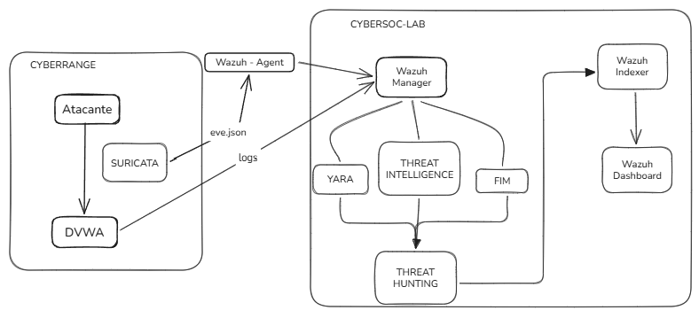

# 🛡️ Wazuh + Suricata + Threat Intelligence + YARA

Laboratorio orientado a la implementación de diferentes capacidades de **detección, análisis y Threat Hunting** dentro de un entorno SOC.

El laboratorio integra **Wazuh**, **Suricata**, **Threat Intelligence**, **YARA** y **File Integrity Monitoring (FIM)** para construir un flujo de detección basado en eventos de red y actividad sobre los endpoints.

---

## 🎯 Objetivos

* :mag: Comprender el funcionamiento de un flujo básico de detección dentro de un SOC.
* :satellite: Integrar **Suricata** con **Wazuh** para detectar actividad de red.
* :shield: Utilizar **Threat Intelligence** para enriquecer eventos mediante indicadores de compromiso (IOC).
* :file_folder: Implementar reglas **YARA** para realizar búsqueda de patrones sobre archivos.
* :page_facing_up: Utilizar **FIM** para detectar modificaciones en archivos.
* :male_detective: Practicar técnicas básicas de **Threat Hunting**.
* :arrows_counterclockwise: Comprender cómo se relacionan las diferentes fuentes de telemetría dentro de un entorno SOC.

---

## 🧰 Tecnologías

| Tecnología                        | Función                                           |
| --------------------------------- | ------------------------------------------------- |
| :shield: **Wazuh**                | SIEM / XDR y plataforma de monitoreo de seguridad |
| :satellite: **Suricata**          | NIDS para análisis de tráfico de red              |
| :warning: **Threat Intelligence** | Enriquecimiento de eventos mediante IOC           |
| :mag: **YARA**                    | Identificación de patrones dentro de archivos     |
| :page_facing_up: **FIM**          | Monitoreo de cambios en archivos                  |
| :whale: **Docker**                | Despliegue de los componentes del entorno         |

---

## 📁 Estructura

```text
02-wazuh-suricata-yara/
│
├── README.md
│
├── 01-conceptos/
│   ├── README.md
│   ├── wazuh.md
│   ├── suricata.md
│   ├── threat-intelligence.md
│   ├── yara.md
│   ├── fim.md
│   └── threat-hunting.md
│
└── 02-laboratorio/
    └── README.md
```

### :books: 01-conceptos

Contiene la documentación conceptual necesaria para comprender las tecnologías y mecanismos utilizados en el laboratorio.

Los conceptos se encuentran separados por tecnología y están orientados a comprender **qué hace cada componente, cómo funciona y qué función cumple dentro del flujo de detección**.

### :microscope: 02-laboratorio

Contiene la implementación práctica del laboratorio, incluyendo la configuración de las máquinas virtuales, Wazuh, Suricata, Threat Intelligence, YARA y FIM.

La documentación mantiene la arquitectura y los parámetros utilizados en el entorno del laboratorio.

---

## 🔄 Flujo general



---

## 🌐 Entorno de red

| Componente                                | Dirección         |
| ----------------------------------------- | ----------------- |
| :computer: VM1 — CyberSOC                 | `192.168.56.10`   |
| :computer: VM2 — CyberRange               | `192.168.56.20`   |
| :globe_with_meridians: Red de laboratorio | `192.168.56.0/24` |
| :whale: Red Docker                        | `172.30.0.0/24`   |
| :computer: DVWA                           | `172.30.0.10`     |
| :warning: Attacker                        | `172.30.0.20`     |

---

## 🧩 Capas del laboratorio

### 1. :satellite: Network Intrusion Detection

**Suricata** analiza el tráfico de red y genera eventos estructurados que posteriormente son procesados por **Wazuh**.

### 2. :warning: Threat Intelligence

Los eventos que contienen indicadores como direcciones IP pueden ser enriquecidos mediante listas de **Threat Intelligence** para aportar contexto adicional a las detecciones.

### 3. :mag_right: Threat Hunting

**YARA** y **FIM** proporcionan capacidades complementarias para buscar patrones en archivos y detectar modificaciones sobre el sistema.

---

## :white_check_mark: Resultado esperado

Al finalizar el laboratorio se contará con un entorno en el que sea posible:

* :computer: Generar actividad controlada desde un atacante.
* :satellite: Detectar tráfico mediante **Suricata**.
* :shield: Procesar los eventos mediante **Wazuh**.
* :warning: Enriquecer indicadores mediante **Threat Intelligence**.
* :mag: Detectar patrones mediante **YARA**.
* :page_facing_up: Detectar modificaciones mediante **FIM**.
* :male_detective: Analizar las evidencias obtenidas mediante técnicas básicas de **Threat Hunting**.

---

> :books: Este laboratorio está orientado al aprendizaje práctico de conceptos y herramientas utilizadas en operaciones de seguridad (**SOC**).
