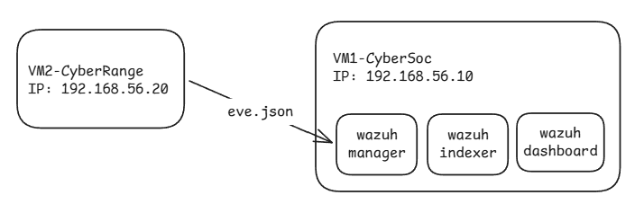

# :wrench: 01 — Preparación del entorno

En esta etapa prepararemos la infraestructura para poder ejecutar el laboratorio.

Es necesario disponer de:

* Dos máquinas virtuales.
* Una red NAT de VMware para comunicar ambas máquinas.
* Direcciones IP estáticas para cada VM.
* Conectividad entre VM1 y VM2.
* Acceso administrativo mediante `sudo`.

---

# :dart: Objetivo

Al finalizar esta etapa tendremos la siguiente base:



La conectividad entre ambas máquinas será necesaria posteriormente para que el **Wazuh Agent de VM2** pueda comunicarse con el **Wazuh Manager de VM1**.

---

# :computer: 1. Identificar las máquinas virtuales

| VM  | Nombre     | IP              | Función                                        |
| --- | ---------- | --------------- | ---------------------------------------------- |
| VM1 | CyberSOC   | `192.168.56.10` | Wazuh Manager, Indexer y Dashboard             |
| VM2 | CyberRange | `192.168.56.20` | Wazuh Agent, Suricata, Docker, DVWA y Attacker |


---

# :globe_with_meridians: 2. Configurar la red NAT de VMware

Red NAT a usar:

```text
192.168.56.0/24
```

Maquinas -> IP_asignadas:

```text
VM1 → 192.168.56.10
VM2 → 192.168.56.20
```

## :gear: 2.1 Crear o seleccionar la red NAT

En VMware se debe disponer de una red virtual configurada como **NAT: 192.168.56.0/24**

Para la configuracion debemos:
```text
    [] Seleccionar edit en la ventana de VMware
    [] Seleccionar en virtual network editor
    [] Seleccionar Add network
    [] Seleccionamos el nombre de una red y agregamos
    [] Ubicamos VMnet Information
    [] Selecionamos NAT
        * Si tenemos una red Nat ya configurada la eliminamos
    [] Configuramos la ip y la mascara de red
    [] Aplicar y aceptar
```

Lo que nos importa es que ambas maquinas

estén conectadas al **mismo segmento NAT**.

> :warning: Las IP utilizadas por las máquinas son estáticas. Por lo tanto, no se debe depender de que DHCP asigne aleatoriamente las direcciones `192.168.56.10` y `192.168.56.20`.

---

# :link: 3. Conectar VM1 y VM2 a la red NAT

En la configuración de hardware de cada máquina virtual, el adaptador de red debe estar conectado a la red NAT utilizada por el laboratorio.

```text
VM1 y VM2
 │
 └── Adaptador de red
       │
       └── Red NAT
             └── 192.168.56.0/24
```

Ambas deben poder comunicarse por `192.168.56.x`.

---

# :computer: 4. Identificar la interfaz de red de cada VM

Este paso es importante porque el nombre de la interfaz puede variar entre máquinas virtuales.

Ejecutar en **VM1 y en VM2**:

```bash
ip -br address
```
El resultado permitirá identificar la interfaz conectada a la red VMware.

Por ejemplo:

```text
ens33
```

> :warning: **No asumir que la interfaz se llama `ens33`.**
>
> Debe reemplazarse por el nombre real de la interfaz obtenida al ejecutar lso comandos.

En los comandos siguientes se utilizará:

```text
<INTERFAZ>
```

como referencia a la interfaz real identificada en cada VM.

---

# :one: 5. Configurar la IP de VM1 y VM2 

## :computer: La configuracion es igual para VM1 y VM2

Para configurar la ip-estatica, como tenemos ubuntu con interfaz
ubicamos la parte de conectividad
vamos a la configuracion y seleccionamos manual
configuramos IPV4 y se asigna las ips correspondientes
para **VM1:192.168.56.10 y para VM2:192.168.56.20**
aceptamos y se nos queda la configuracion la ip estatica
corroboramos haciendo 

desde VM1 -> VM2:

```bash
ping -c 4 192.168.56.20
```
Desde VM2 -> VM1:

```bash
ping -c 4 192.168.56.20
```

Resultado esperado para ambas:

```text
4 packets transmitted
4 packets received
```

---

# :mag_right: 6. Verificación completa de la red

Comprobamos:

### En VM1 y VM2 es igual la comprobacion

```bash
ip -br address
```

Debe mostrar:

```text
192.168.56.10/24
```

Y:

```bash
ping -c 4 192.168.56.20
```

Debe recibir respuestas desde VM2/1.

---

# :warning: 7. Si el ping no funciona

Si una de las pruebas falla, **no continuar todavía con el laboratorio**.

Revisar en este orden:

### 1. Adaptador de red de VMware

Comprobar que ambas VMs estén conectadas a la misma red NAT.


### 2. Interfaz de red

En cada VM:

```bash
ip -br address
```

Comprobar que la interfaz utilizada esté activa.

### 3. Dirección IP

VM1:

```text
192.168.56.10/24
```

VM2:

```text
192.168.56.20/24
```

### 4. Conectividad

Desde VM1:

```bash
ping -c 4 192.168.56.20
```

Desde VM2:

```bash
ping -c 4 192.168.56.10
```

No avanzar a las siguientes etapas hasta resolver cualquier problema de conectividad.

---

# :clipboard: 8. Estado de la preparación

Antes de continuar verificar la conexion entre las maquinas etc.

# :arrow_forward: Siguiente paso

Con la conectividad entre las dos máquinas verificada, continuar con:

➡️ [02-wazuh.md](./02-wazuh.md)

En la siguiente etapa se comenzará la configuración de **Wazuh**, incluyendo el Manager, Indexer, Dashboard y Agent.