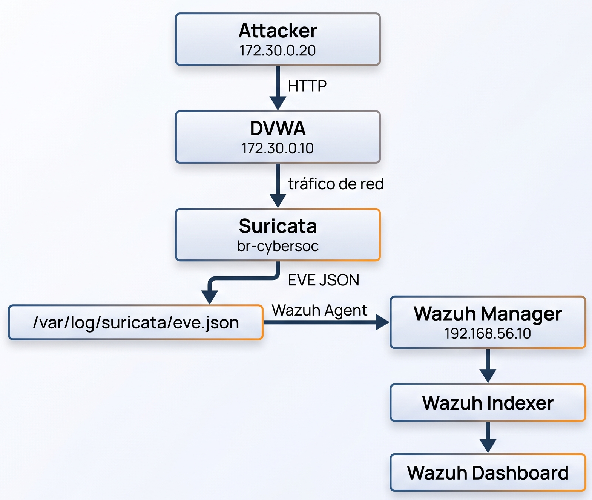
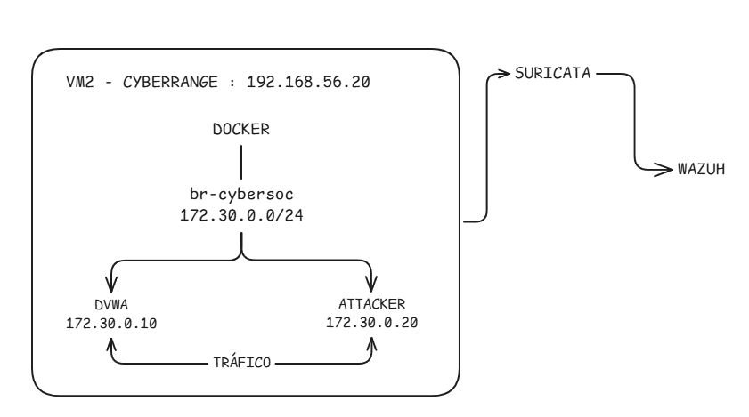
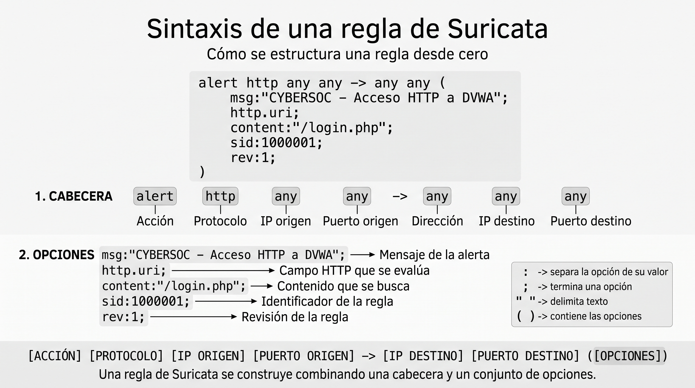
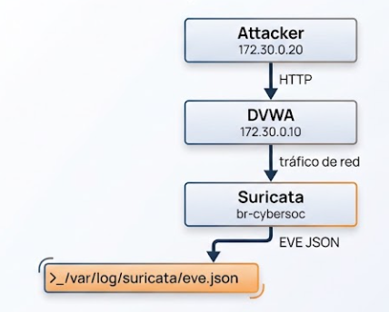

# :satellite: 03 — Suricata

**Suricata** actuara como NIDS (Network Intrusion Detection System) dentro de VM2.

Encargado de inspeccionar el tráfico generado dentro de la red Docker del laboratorio y generar eventos estructurados en formato **EVE JSON**.

Estos eventos serán posteriormente recogidos por el Wazuh Agent y enviados al Wazuh Manager.

---

# :dart: Objetivo

Al finalizar esta etapa tendremos funcionando el siguiente flujo:



Crearemos una regla en suricata para detectar solicitudes HTTP hacia:

```text
/login.php
```

La regla utilizará:

```text
SID: 1000001
```

y el mensaje:

```text
CYBERSOC - Acceso HTTP a DVWA
```

---

# :whale: 1. Preparar la red Docker del laboratorio

Creamos la red de docker sobre la cual se observara el trafico.

La red utilizada es:

```text
Network: cybersoc_lab
Subnet:  172.30.0.0/24
Bridge:  br-cybersoc
```

Los dos contenedores principales serán:



---

# :file_folder: 1.1 Crear el directorio del laboratorio

En **VM2**, crear el directorio:

```bash
sudo mkdir -p /opt/cybersoc-lab
```

Entrar en él:

```bash
cd /opt/cybersoc-lab
```

Verificar:

```bash
pwd
```

Resultado esperado:

```text
/opt/cybersoc-lab
```

Este será el directorio donde se almacenará la configuración Docker utilizada por DVWA y el atacante.

---

# :memo: 1.2 Crear `compose.yml`

Dentro de:

```text
/opt/cybersoc-lab
```

crear:

```bash
sudo nano compose.yml
```

El archivo debe contener:

```yaml
services:
  dvwa:
    image: vulnerables/web-dvwa:latest
    container_name: cybersoc-dvwa
    restart: unless-stopped
    networks:
      lab:
        ipv4_address: 172.30.0.10
    ports:
      - "127.0.0.1:8080:80"

  attacker:
    image: curlimages/curl:latest
    container_name: cybersoc-attacker
    command: ["sleep", "infinity"]
    restart: unless-stopped
    networks:
      lab:
        ipv4_address: 172.30.0.20
    depends_on:
      - dvwa

networks:
  lab:
    name: cybersoc_lab
    driver: bridge
    driver_opts:
      com.docker.network.bridge.name: br-cybersoc
    ipam:
      config:
        - subnet: 172.30.0.0/24
```

Esta configuración define:

* El contenedor `cybersoc-dvwa`.
* El contenedor `cybersoc-attacker`.
* La red `cybersoc_lab`.
* El bridge `br-cybersoc`.
* La subred `172.30.0.0/24`.
* La IP `172.30.0.10` para DVWA.
* La IP `172.30.0.20` para Attacker.

---

# :mag: 1.3 Validar el archivo Docker Compose

Antes de iniciar los contenedores, validar el archivo:

```bash
sudo docker compose config
```

El comando debe finalizar sin errores de sintaxis.

> :white_check_mark: Es recomendable validar primero el archivo y levantar los contenedores después. Así podemos distinguir un problema de configuración de Docker de un problema posterior de Suricata.

---

# :rocket: 1.4 Iniciar DVWA y Attacker

Ejecutar:

```bash
sudo docker compose up -d
```

Verificar:

```bash
sudo docker compose ps
```

Deben aparecer:

```text
cybersoc-dvwa
cybersoc-attacker
```

como contenedores ejecutándose.

---

# :link: 1.5 Verificar el bridge Docker

El laboratorio utiliza específicamente:

```text
br-cybersoc
```

Comprobar que existe:

```bash
ip link show br-cybersoc
```

Debe aparecer la interfaz correspondiente al bridge.

También se puede consultar la red Docker:

```bash
sudo docker network inspect cybersoc_lab
```

Dentro de la información obtenida deben aparecer la red:

```text
172.30.0.0/24
```

y los contenedores con sus respectivas direcciones.

---

# :mag: 1.6 Verificar las direcciones de los contenedores

Ejecutar:

```bash
sudo docker inspect -f '{{range.NetworkSettings.Networks}}{{.IPAddress}}{{end}}' cybersoc-dvwa
```

Resultado esperado:

```text
172.30.0.10
```

Para Attacker:

```bash
sudo docker inspect -f '{{range.NetworkSettings.Networks}}{{.IPAddress}}{{end}}' cybersoc-attacker
```

Resultado esperado:

```text
172.30.0.20
```

---

# :globe_with_meridians: 3. Probar la comunicación con DVWA

Antes de instalar y configurar Suricata debemos comprobar que el tráfico que posteriormente queremos detectar realmente existe.

La prueba se realizará desde el contenedor atacante.

Ejecutar:

```bash
sudo docker compose exec attacker \
  curl -I http://dvwa/login.php
```

El resultado esperado es una respuesta HTTP:

```text
HTTP/1.1 200 OK
```

Esto confirma que:

```text
Attacker : 172.30.0.20 --->http---> DVWA : 172.30.0.10
```

pueden comunicarse correctamente.

> :warning: Si falla la prueba solucionar, para luego proseguir con la instalacion de suricata.

---

# :satellite: 4. Instalar Suricata

Suricata se instalará directamente en:

```text
VM2 — CyberRange
```
Esto es importante porque Suricata deberá inspeccionar directamente la interfaz Linux:

```text
br-cybersoc
```

---

## :package: 4.1 Instalar los requisitos

Actualizar los paquetes:

```bash
sudo apt update
```

Instalar `software-properties-common`:

```bash
sudo apt install -y software-properties-common
```

Agregar el repositorio estable de Suricata:

```bash
sudo add-apt-repository -y ppa:oisf/suricata-stable
```

Actualizar nuevamente:

```bash
sudo apt update
```

Instalar Suricata y `jq`:

```bash
sudo apt install -y suricata jq
```

`jq` sirve para realizar consultas de eventos JSON generados por Suricata.

---

# :mag: 4.2 Verificar la instalación

Ejecutar:

```bash
suricata --build-info
```
Debe mostrar info sobre la version y caracteristicas con las que se compilo Suricata.

---

# :shield: 5. Actualizar las reglas de Suricata

Suricata utiliza reglas para determinar qué patrones de tráfico debe detectar.

Actualizar las reglas disponibles mediante:

```bash
sudo suricata-update
```

Después comprobar que existe el archivo generado:

```bash
sudo ls -lh /var/lib/suricata/rules/suricata.rules
```

Debe existir:

```text
/var/lib/suricata/rules/suricata.rules
```

> :information_source: Estas son las reglas generales que Suricata tiene por defecto y en estas se agregara nuestra regla local.

---

# :wrench: 6. Configurar Suricata

El archivo principal de configuración de Suricata es:

```text
/etc/suricata/suricata.yaml
```

Este archivo controla, entre otras cosas:

* Redes consideradas internas.
* Interfaces que Suricata inspeccionará.
* Salidas de eventos.
* Archivos de reglas.

Abrimos:

```bash
sudo nano /etc/suricata/suricata.yaml
```

---

# :globe_with_meridians: 6.1 Configurar `HOME_NET`

Dentro de `suricata.yaml`, localizar la sección de variables de red.

Configurar:

```yaml
HOME_NET: "[172.30.0.0/24]"
EXTERNAL_NET: "any"
```
`HOME_NET` representa la red Docker donde se encuentran, DVWA y ACTTACKER:

---

# :satellite: 6.2 Configurar la interfaz de captura

Suricata debe inspeccionar el tráfico que atraviesa la red Docker.

La interfaz utilizada es:

```text
br-cybersoc
```

Dentro de `suricata.yaml`, localizar:

```yaml
af-packet:
```

Configurar el primer bloque para utilizar:

```yaml
af-packet:
  - interface: br-cybersoc
```

La interfaz es especialmente importante porque el tráfico entre:

```text
Attacker --> DVWA
```

atraviesa el bridge Docker:

```text
br-cybersoc
```

Por eso Suricata debe escuchar esa interfaz.

---

# :page_facing_up: 6.3 Configurar EVE JSON

Suricata puede generar diferentes tipos de logs.

Utilizaremos **EVE JSON**, nos permite que Wazuh recopile eventos estructurados.

El archivo utilizado será:

```text
/var/log/suricata/eve.json
```

Dentro de `suricata.yaml`, localizar la sección:

```yaml
outputs:
```

y comprobar la configuración existente de `eve-log`.

Debe existir una configuración equivalente a:

```yaml
- eve-log:
    enabled: yes
    filetype: regular
    filename: eve.json
```

> :warning: **No duplicar la sección `eve-log`.**
>
> Si ya existe una configuración de EVE JSON, modificar la existente en lugar de crear una segunda configuración.

---

# :mag: 7. Crear la regla personalizada de Suricata

La regla detectará solicitudes HTTP cuyo URI contenga:

```text
/login.php
```

El archivo utilizado será:

```text
/etc/suricata/rules/local.rules
```

---

## :file_folder: 7.1 Crear el directorio de reglas locales

Ejecutar:

```bash
sudo mkdir -p /etc/suricata/rules
```

---

## :memo: 7.2 Crear `local.rules`

Abrir:

```bash
sudo nano /etc/suricata/rules/local.rules
```

**como creamos la regla?**


Agregar:

```text
alert http any any -> $HOME_NET any (msg:"CYBERSOC - Acceso HTTP a DVWA"; flow:established,to_server; http.uri; content:"/login.php"; nocase; sid:1000001; rev:1;)
```

La regla queda definida con:

| Campo       | Valor                           |
| ----------- | ------------------------------- |
| Acción      | `alert`                         |
| Protocolo   | `http`                          |
| Dirección   | hacia `$HOME_NET`               |
| Mensaje     | `CYBERSOC - Acceso HTTP a DVWA` |
| URI buscado | `/login.php`                    |
| SID         | `1000001`                       |
| Revisión    | `1`                             |

---

# :warning: 7.3 No confundir el SID con las reglas de Wazuh

El identificador:

```text
1000001
```

pertenece a **Suricata**.

No es una regla de Wazuh.

existen otros identificadoes:

```text
1000001 → Suricata
86601   → Wazuh
100500  → Wazuh
100600  → Wazuh
```
---

# :link: 8. Cargar la regla local

Crear la regla no es suficiente.

Suricata también debe saber que el archivo:

```text
/etc/suricata/rules/local.rules
```

forma parte de las reglas que debe cargar.

Volver a abrir:

```bash
sudo nano /etc/suricata/suricata.yaml
```

Localizar:

```yaml
rule-files:
```

La configuración debe incluir:

```yaml
rule-files:
  - suricata.rules
  - /etc/suricata/rules/local.rules
```

`suricata-update` es el lugar donde encontramos las reglas predeterminadas.

`/etc/suricata/rules/local.rules` incorpora nuestras reglas personalizadas.

---

# :white_check_mark: 9. Validar la configuración de Suricata

Antes de iniciar o reiniciar el servicio debemos validar la configuración.

Ejecutar:

```bash
sudo suricata -T \
  -c /etc/suricata/suricata.yaml \
  -i br-cybersoc
```

El resultado esperado incluye:

```text
Configuration provided was successfully loaded
```

Esto indica que Suricata pudo cargar la configuración y las reglas.

> :warning: Si falla la validacion, debemos corregir el error.

---

# :gear: 10. Configurar el servicio Suricata

Además de la configuración principal, el servicio debe saber sobre qué interfaz ejecutar Suricata.

El archivo utilizado es:

```text
/etc/default/suricata
```

Abrir:

```bash
sudo nano /etc/default/suricata
```

Configurar:

```text
RUN=yes
IFACE=br-cybersoc
```

Esto indica que:

```text
Suricata ->br-cybersoc
```

será la interfaz utilizada para la captura.

---

# :rocket: 10.1 Iniciar Suricata

Habilitar el servicio:

```bash
sudo systemctl enable --now suricata
```

Reiniciar para aplicar la configuración:

```bash
sudo systemctl restart suricata
```

---

# :mag: 10.2 Verificar el servicio

Ejecutar:

```bash
sudo systemctl status suricata --no-pager
```

El estado esperado es:

```text
Active: active (running)
```

También revisar los últimos mensajes:

```bash
sudo tail -n 30 /var/log/suricata/suricata.log
```

Si esta todo ok, podemos avanzar con las pruebas 
---

# :test_tube: 11. Prueba local de Suricata

Ahora generaremos tráfico controlado desde el atacante hacia DVWA.

El objetivo es producir una solicitud:

```text
GET /login.php
```

que debería coincidir con la regla:

```text
SID 1000001
```

---

# :arrow_forward: 11.1 Generar tráfico

En VM2:

```bash
cd /opt/cybersoc-lab
```

Ejecutar:

```bash
sudo docker compose exec attacker \
  curl -s http://dvwa/login.php >/dev/null
```

El comando genera una solicitud HTTP desde:

```text
172.30.0.20
```

hacia:

```text
172.30.0.10
```

---

# :mag: 11.2 Buscar la alerta en EVE JSON

Suricata debe haber registrado el evento en:

```text
/var/log/suricata/eve.json
```

Utilizar `jq` para buscar específicamente nuestra regla:

```bash
sudo jq -c \
  'select(.event_type=="alert" and .alert.signature_id==1000001)' \
  /var/log/suricata/eve.json | tail
```

---

# :white_check_mark: 11.3 Resultado esperado

Debe aparecer un evento con información equivalente a:

```text
src_ip:       172.30.0.20
dest_ip:      172.30.0.10
signature_id: 1000001
signature:    CYBERSOC - Acceso HTTP a DVWA
```

El punto importante es comprobar que Suricata identificó:

```text
Attacker : 172.30.0.20 -> HTTP /login.php -> DVWA : 172.30.0.10 -> Regla 1000001
```

El laboratorio de referencia utiliza esta misma prueba para validar la detección local de Suricata.

---

# :shield: 12. Integrar Suricata con Wazuh

Tenemos: 

 
Wazuh aun no está leyendo ese archivo.

Ahora configuraremos el Wazuh Agent de VM2 para recopilar:

```text
/var/log/suricata/eve.json
```

---

# :computer: 12.1 Configurar el Wazuh Agent

Este paso se realiza en:

```text
VM2 — CyberRange
```

El archivo de configuración del Agent es:

```text
/var/ossec/etc/ossec.conf
```

Abrir:

```bash
sudo nano /var/ossec/etc/ossec.conf
```

Antes del último:

```xml
</ossec_config>
```

agregar:

```xml
<localfile>
  <log_format>json</log_format>
  <location>/var/log/suricata/eve.json</location>
</localfile>
```

Esta configuración indica al Wazuh Agent:

```text
Leer:
    /var/log/suricata/eve.json

Formato:
    JSON
```

---

# :mag: 12.2 Validar la configuración del Agent

Antes de reiniciar el servicio, validamos la configuración del Agent:

```bash
sudo /var/ossec/bin/wazuh-agentd -t
```

También validar el componente encargado de la recolección de logs:

```bash
sudo /var/ossec/bin/wazuh-logcollector -t
```

Ambos comandos deben finalizar sin errores de configuración.

---

# :arrows_counterclockwise: 12.3 Reiniciar Wazuh Agent

Aplicar la nueva configuración:

```bash
sudo systemctl restart wazuh-agent
```

Verificar:

```bash
sudo systemctl status wazuh-agent --no-pager
```

El resultado esperado:

```text
Active: active (running)
```

---

# :test_tube: 13. Prueba completa de Suricata + Wazuh

Ahora comprobaremos el flujo completo.

La prueba generará varios eventos HTTP.

---

## :computer: 13.1 Generar cinco eventos

En VM2:

```bash
cd /opt/cybersoc-lab
```

Ejecutar:

```bash
for i in 1 2 3 4 5; do
  sudo docker compose exec -T attacker \
    curl -s "http://dvwa/login.php?prueba=$i" >/dev/null
done
```

Esto genera cinco solicitudes diferentes:

```text
/login.php?prueba=1
/login.php?prueba=2
/login.php?prueba=3
/login.php?prueba=4
/login.php?prueba=5
```

Todas contienen:

```text
/login.php
```

por lo que deberían coincidir con la regla `1000001`.

---

# :satellite: 13.2 Verificar los eventos en Suricata

Ejecutar:

```bash
sudo jq -c \
  'select(.event_type=="alert" and .alert.signature_id==1000001)' \
  /var/log/suricata/eve.json | tail -5
```

Deberían aparecer los eventos generados por las cinco solicitudes.

---

# :shield: 13.3 Verificar los eventos en Wazuh Manager VM1 — CyberSOC

Comprobamos que los eventos recorrieron el siguiente camino:

```text
eve.json -> Wazuh Agent -> Wazuh Manager
```
Entramos en:

```bash
cd /opt/wazuh-docker/single-node
```

Ejecutar:

```bash
sudo docker compose exec wazuh.manager sh -c \
  "grep 'CYBERSOC - Acceso HTTP a DVWA' /var/ossec/logs/alerts/alerts.json | tail"
```

Si la integración funciona, deben aparecer las alertas correspondientes al mensaje:

```text
CYBERSOC - Acceso HTTP a DVWA
```

---

# :desktop_computer: 13.4 Verificar en Wazuh Dashboard

Acceder desde el navegador:

```text
https://192.168.56.10
```

Buscar los eventos relacionados con Suricata.

En el Dashboard se pueden utilizar consultas como:

```text
rule.groups:suricata
```

y:

```text
data.alert.signature_id:1000001
```

Estas consultas permiten localizar los eventos relacionados con la integración de Suricata.

---

# :warning: 14. Identificadores importantes

En esta etapa aparecen dos identificadores que no deben confundirse.

### Suricata

```text
SID: 1000001
```

Regla:

```text
CYBERSOC - Acceso HTTP a DVWA
```

### Wazuh

Cuando Wazuh procesa posteriormente los eventos de Suricata aparecerá su propia identificación de reglas.

La regla base documentada para estos eventos es:

```text
86601
```

Por lo tanto:

```text
1000001 → Suricata
86601   → Wazuh
```

---

# :arrow_forward: Siguiente paso

La siguiente etapa será:

➡️ [04-threat-intelligence.md](./04-threat-intelligence.md)

Allí se utilizará la CDB List:

```text
/var/ossec/etc/lists/threat-intel-ip
```

para asociar una etiqueta de Threat Intelligence a la IP:

```text
172.30.0.20
```

y posteriormente procesarla mediante la regla personalizada de Wazuh:

```text
100500
```

El objetivo será pasar de una alerta de detección de Suricata a una alerta enriquecida con contexto de Threat Intellige