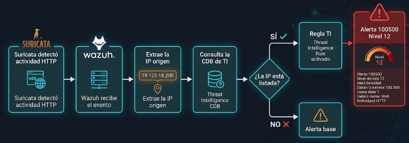
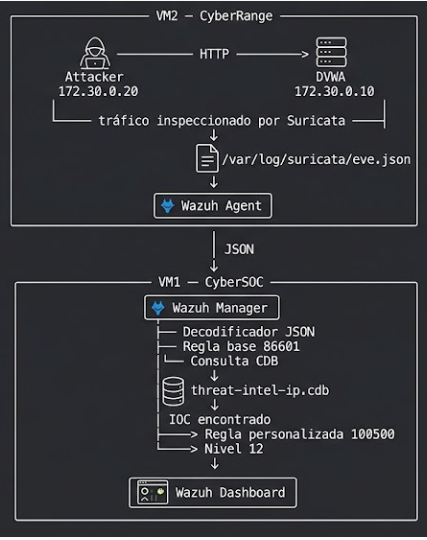
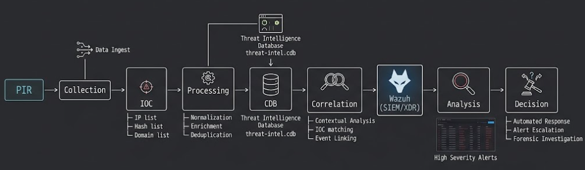
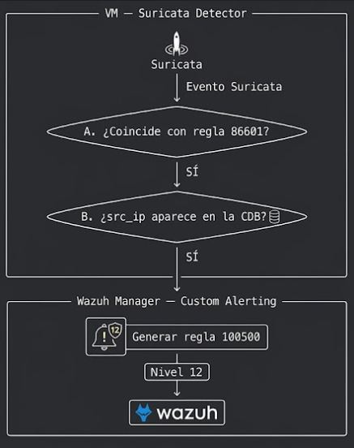
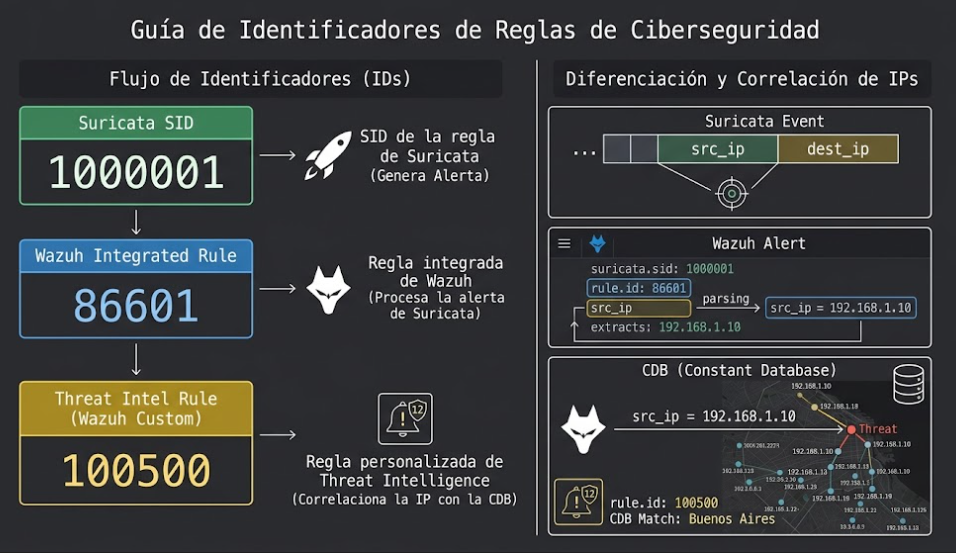

# :mag: 04 - Threat Intelligence

## :dart: Intro

**Suricata**  detecta una peticion HTTP hacia DVWA y genera un evento en `eve.json`.

Con **Threat Intelligence (TI)** le daremos contexto  a ese evento.

La idea es pasar de una alerta  a :




La IP del atacante `172.30.0.20` será utilizada como un **IOC ficticio**.

---

## :building_construction: Arquitectura de esta etapa

| Componente          | Ubicación     | Función                                     |
| ------------------- | ------------- | ------------------------------------------- |
| `cybersoc-attacker` | `172.30.0.20` | Genera tráfico controlado                   |
| `cybersoc-dvwa`     | `172.30.0.10` | Aplicación web víctima                      |
| Suricata            | VM2           | Detecta el tráfico HTTP                     |
| `eve.json`          | VM2           | Contiene los eventos generados por Suricata |
| Wazuh Agent         | VM2           | Envía `eve.json` al Manager                 |
| Wazuh Manager       | VM1           | Decodifica, correlaciona y aplica reglas    |
| CDB List            | VM1           | Contiene los IOC de Threat Intelligence     |
| Regla `100500`      | VM1           | Genera la alerta TI                         |
| Wazuh Dashboard     | VM1           | Permite visualizar la alerta                |

### Flujo


---

# :clipboard: 1. Concepto de Threat Intelligence

Wazuh sabe que Suricata detectó una actividad determinada.

```text
src_ip  = 172.30.0.20
dest_ip = 172.30.0.10
signature_id = 1000001
```

La detección responde principalmente:

> **¿Qué actividad fue observada?**

Threat Intelligence agrega otra pregunta:

> **¿Tenemos información previa sobre alguno de los indicadores observados?**

Utilizaremos una lista de IOC basada en direcciones IP.

La lista tendrá el formato `key: valor`:

```text
IP:etiqueta
172.30.0.20:PurpleWolf-C2-high
```

Wazuh buscará la clave.


---

# :dart: 2. Configuramos PIR

**Priority Intelligence Requirement** para dar contexto.

### PIR

> ¿Existe actividad de red asociada con indicadores previamente clasificados como maliciosos dentro del entorno CyberSOC?

El ciclo:


---

# :test_tube: 3. Verificar que la detección base funciona

## 3.1 Verificar Suricata

Ejecutar en **VM2**:

```bash
sudo systemctl status suricata --no-pager
```
Debe aparecer active

---

## 3.2 Verificar Wazuh Agent

En **VM2**:

```bash
sudo systemctl status wazuh-agent --no-pager

#Además, comprobar la comunicación:

sudo grep -Ei 'connected|unable|error' \
  /var/ossec/logs/ossec.log | tail -20
```

---

## 3.3 Verificar el agente desde el Manager

En **VM1**:

```bash
cd /opt/wazuh-docker/single-node

sudo docker compose exec -T wazuh.manager \
  /var/ossec/bin/agent_control -lc

# cyberrange-suricata    Active
```

>La comprobación importante es `agent_control`.

---

# :globe_with_meridians: 4. Verificar la comunicación Attacker → DVWA

En **VM2**:

```bash
cd /opt/cybersoc-lab

sudo docker compose exec -T attacker \
  curl -I http://dvwa/login.php
```

Resultado esperado:

```text
HTTP/1.1 200 OK
```
está funcionando.

---

# :page_facing_up: 5. Verificar la recolección de `eve.json`

El Wazuh Agent debe estar configurado para leer `/var/log/suricata/eve.json`:

Comprobarlo en VM2:

```bash
sudo grep -n -B3 -A5 \
  '/var/log/suricata/eve.json' \
  /var/ossec/etc/ossec.conf
```

Debe existir:

```xml
<localfile>
  <log_format>json</log_format>
  <location>/var/log/suricata/eve.json</location>
</localfile>
```

Validar el recolector:

```bash
sudo /var/ossec/bin/wazuh-logcollector -t
```

---

# :traffic_light: 6. Generar un evento de línea base

En **VM2**:

```bash
cd /opt/cybersoc-lab

sudo docker compose exec -T attacker \
  curl -s \
  "http://dvwa/login.php?baseline=threatintel" \
  >/dev/null

sleep 3
```

---

# :mag: 7. Confirmar la detección en Suricata

En VM2:

```bash
sudo jq -c \
  'select(
    .event_type=="alert"
    and .alert.signature_id==1000001
  )' \
  /var/log/suricata/eve.json | tail -1
```

Debemos comprobar principalmente:

```text
src_ip        = 172.30.0.20
dest_ip       = 172.30.0.10
signature_id  = 1000001
```

La firma `1000001` corresponde a nuestra regla definida en **Suricata**.

---

# :satellite: 8. Confirmar la llegada a Wazuh

En **VM1**:

```bash
cd /opt/wazuh-docker/single-node

sudo docker compose exec -T wazuh.manager \
  sh -c \
  "grep 'baseline=threatintel' \
  /var/ossec/logs/alerts/alerts.json | tail -1"
```

La regla `86601` es la regla base de Wazuh que procesa la alerta de Suricata.

Tenemos entonces:

```text
Suricata
   ↓
SID 1000001
   ↓
eve.json
   ↓
Wazuh Agent
   ↓
Wazuh Manager
   ↓
Rule 86601
```

**Aún no existe la correlación con Threat Intelligence**.

---

# :card_file_box: 9. Crear el feed de Threat Intelligence

Crearemos una lista CDB con nuestros IOC.

La lista será:

```text
172.30.0.20:PurpleWolf-C2-high
```

### ¿Qué significa cada parte?

```text
172.30.0.20 : PurpleWolf-C2-high
      │              │
      │              └── valor / etiqueta
      │
      └── clave / IOC
```

En nuestro contexto:

* `172.30.0.20` es la IP del atacante del laboratorio.

---

# :file_folder: 10. Creamos la CDB List en Wazuh

La lista se almacenará en el **Wazuh Manager**, dentro del contenedor.

En VM1:

```bash
cd /opt/wazuh-docker/single-node
```

Crear la lista:

```bash
sudo docker compose exec -T wazuh.manager \
  sh -c 'cat > /var/ossec/etc/lists/threat-intel-ip' <<'EOF'
172.30.0.20:PurpleWolf-C2-high
EOF
```

Verificar:

```bash
sudo docker compose exec -T wazuh.manager \
  cat /var/ossec/etc/lists/threat-intel-ip
```

Debe mostrar:

```text
172.30.0.20:PurpleWolf-C2-high
```

---

# :lock: 11. Configurar los permisos de la CDB

El usuario `wazuh` debe poder trabajar con la lista.

Ejecutar en VM1:

```bash
sudo docker compose exec -u 0 -T wazuh.manager sh -c '
chown wazuh:wazuh /var/ossec/etc/lists
chmod 770 /var/ossec/etc/lists

chown wazuh:wazuh /var/ossec/etc/lists/threat-intel-ip
chmod 660 /var/ossec/etc/lists/threat-intel-ip
'
```

Verificar:

```bash
sudo docker compose exec -T wazuh.manager \
  ls -ld /var/ossec/etc/lists

sudo docker compose exec -T wazuh.manager \
  ls -l /var/ossec/etc/lists/threat-intel-ip
```
---

# :gear: 12. Registramos la CDB en Wazuh

Creamos una copia de seguridad de la configuración:

```bash
cd /opt/wazuh-docker/single-node

sudo cp -p \
  config/wazuh_cluster/wazuh_manager.conf \
  "config/wazuh_cluster/wazuh_manager.conf.bak-threat-intel-$(date +%s)"
```

Editar:

```bash
sudo nano config/wazuh_cluster/wazuh_manager.conf
```

Dentro del bloque `<ruleset>` debe existir:

```xml
<list>etc/lists/threat-intel-ip</list>
```

La estructura es:

```xml
<ruleset>
    ...
    <list>etc/lists/threat-intel-ip</list>
    ...
</ruleset>
```

### ¿Qué estamos haciendo?

Le decimos a Wazuh:

> Esta lista debe formar parte de las listas que utiliza el motor de reglas.

La lista por sí sola **no genera una alerta**.

---

# :mag: 14. Verificar el registro

En VM1:

```bash
grep -n -B5 -A5 \
  "threat-intel-" \
  config/wazuh_cluster/wazuh_manager.conf
```

Debemos comprobar que:

```xml
<list>etc/lists/threat-intel-ip</list>
```

aparece dentro del bloque `<ruleset>`.

---

# :rotating_light: 15. Crear la regla personalizada de Threat Intelligence

Ahora necesitamos una regla que responda a esta condición:



Crear el archivo de reglas:

```bash
sudo docker compose exec -T wazuh.manager \
  sh -c 'cat > /var/ossec/etc/rules/cybersoc_threat_intel.xml' <<'EOF'
<group name="threat_intelligence,">

  <rule id="100500" level="12">
    <if_sid>86601</if_sid>
    <list field="src_ip" lookup="address_match_key">etc/lists/threat-intel-ip</list>
    <description>CYBERSOC - Threat Intelligence IOC detected</description>
    <group>threat_intelligence,malicious_ioc,</group>
  </rule>

</group>
EOF
```

---

# :brain: 16. Entender la regla `100500`

La regla esta compuesta por:

| Elemento                     | Función                                                   |
| ---------------------------- | --------------------------------------------------------- |
| `id="100500"`                | Identifica nuestra regla                                  |
| `level="12"`                 | Nivel asignado cuando se cumplen las condiciones          |
| `<if_sid>86601</if_sid>`     | La alerta debe haber coincidido primero con la regla base |
| `field="src_ip"`             | Campo que contiene la IP que queremos consultar           |
| `lookup="address_match_key"` | Busca la IP como clave dentro de la CDB                   |
| `etc/lists/threat-intel-ip`  | Lista de Threat Intelligence                              |
| `<description>`              | Descripción de la alerta                                  |
| `<group>`                    | Categorías de la alerta                                   |

### En lenguaje sencillo

La regla dice:

> Si el evento fue procesado por la regla `86601` y su `src_ip` existe como clave dentro de `threat-intel-ip`, genera la alerta `100500` con nivel `12`.

---

# :warning: 17. Diferenciar los tres identificadores



Son identificadores pertenecientes a **tres mecanismos diferentes**.

---

# :lock: 18. Configurar permisos de la regla

Ejecutar en VM1:

```bash
sudo docker compose exec -u 0 -T wazuh.manager sh -c '
chown wazuh:wazuh /var/ossec/etc/rules/cybersoc_threat_intel.xml
chmod 660 /var/ossec/etc/rules/cybersoc_threat_intel.xml
'
```

Verificar:

```bash
sudo docker compose exec -T wazuh.manager \
  ls -l /var/ossec/etc/rules/cybersoc_threat_intel.xml
```

Y revisar el contenido:

```bash
sudo docker compose exec -T wazuh.manager \
  cat /var/ossec/etc/rules/cybersoc_threat_intel.xml
```

---

# :arrows_counterclockwise: 19. Aplicar la nueva configuración

En VM1:

```bash
cd /opt/wazuh-docker/single-node

sudo docker compose down
sudo docker compose up -d
```

> **Importante:** no utilizar `docker compose down -v`. El parámetro `-v` elimina los volúmenes persistentes.

Esperar la inicialización:

```bash
sleep 30
```

Comprobar:

```bash
sudo docker compose ps
```

Los servicios principales deben aparecer levantados:

```text
wazuh.manager
wazuh.indexer
wazuh.dashboard
```

---

# :mag: 20. Verificar que Wazuh recibió la configuración

Comprobar dentro del Manager:

```bash
sudo docker compose exec -T wazuh.manager \
  grep -n "threat-intel-ip" \
  /var/ossec/etc/ossec.conf
```

Debe aparecer:

```xml
<list>etc/lists/threat-intel-ip</list>
```

---

# :card_file_box: 21. Verificar la compilación de la CDB

Wazuh utiliza la lista de texto y genera su representación binaria `.cdb`.

Ejecutar:

```bash
sudo docker compose exec -T wazuh.manager \
  sh -c \
  'ls -lah /var/ossec/etc/lists/threat-intel-ip*'
```

Debemos encontrar:

```text
threat-intel-ip
threat-intel-ip.cdb
```

Conceptualmente:

```text
threat-intel-ip
      │
      │ compilación
      ↓
threat-intel-ip.cdb
      │
      ↓
Wazuh puede realizar consultas
```

---

# :white_check_mark: 22. Validar el motor de análisis

Ejecutar:

```bash
sudo docker compose exec -T wazuh.manager \
  /var/ossec/bin/wazuh-analysisd -t
```

La validación debe finalizar sin errores de sintaxis XML ni problemas relacionados con la lista.

---

# :satellite: 23. Reconectar el Wazuh Agent

El Manager fue reiniciado, por lo que en VM2 reiniciamos el agente:

```bash
sudo systemctl restart wazuh-agent

sleep 3

sudo systemctl status wazuh-agent --no-pager
```

Revisar comunicación:

```bash
sudo grep -Ei \
  'connected|unable|error' \
  /var/ossec/logs/ossec.log | tail -20
```

Buscar:

```text
Connected to the server
```

---

# :mag: 24. Confirmar el estado del agente

En VM1:

```bash
cd /opt/wazuh-docker/single-node

sudo docker compose exec -T wazuh.manager \
  /var/ossec/bin/agent_control -lc
```

Debe aparecer:

```text
cyberrange-suricata    Active
```
---

# :test_tube: 25. Generar tráfico específico para Threat Intelligence

En VM2:

```bash
cd /opt/cybersoc-lab

sudo docker compose exec -T attacker \
  curl -s \
  "http://dvwa/login.php?threatintel=ti-test-1" \
  >/dev/null

sleep 2
```

---

# :mag: 26. Verificar el evento en Suricata

En VM2:

```bash
sudo jq -c 'select(
  .event_type=="alert"
  and .alert.signature_id==1000001
  and ((.http.url // "") | contains("threatintel=ti-test"))
)' \
/var/log/suricata/eve.json | tail -1
```

Debemos encontrar:

```text
src_ip = 172.30.0.20
```

y una URL similar a:

```text
/login.php?threatintel=ti-test-1
```

Esto demuestra:

```text
Attacker
   ↓
DVWA
   ↓
Suricata
   ↓
SID 1000001
   ↓
eve.json
```

---

# :repeat: 27. Generar una ráfaga de eventos

Para facilitar las verificaciones posteriores:

```bash
for i in 1 2 3 4 5; do
  sudo docker compose exec -T attacker \
    curl -s \
    "http://dvwa/login.php?threatintel=ti-$i" \
    >/dev/null
done

sleep 3
```

---

# :page_facing_up: 28. Verificar los eventos en `eve.json`

```bash
sudo jq -c 'select(
  .event_type=="alert"
  and .alert.signature_id==1000001
  and ((.http.url // "") | contains("threatintel=ti-"))
)' \
/var/log/suricata/eve.json | tail -5
```

Podemos formatear el último evento:

```bash
sudo jq -c 'select(
  .event_type=="alert"
  and .alert.signature_id==1000001
  and ((.http.url // "") | contains("threatintel=ti-"))
)' \
/var/log/suricata/eve.json |
tail -1 |
jq '{
  timestamp,
  src_ip,
  src_port,
  dest_ip,
  dest_port,
  signature_id: .alert.signature_id,
  signature: .alert.signature,
  severity: .alert.severity,
  url: .http.url
}'
```

---

# :test_tube: 29. Probar la regla con `wazuh-logtest`

En VM1:

```bash
cd /opt/wazuh-docker/single-node

sudo docker compose exec -it \
  wazuh.manager \
  /var/ossec/bin/wazuh-logtest
```

Para obtener un evento JSON real desde VM2:

```bash
sudo jq -c 'select(
  .event_type=="alert"
  and .alert.signature_id==1000001
  and ((.http.url // "") | contains("threatintel=ti-"))
)' \
/var/log/suricata/eve.json | tail -1
```

Copiar la línea JSON resultante y pegarla en `wazuh-logtest`.

---

# :dart: 30. Resultado esperado de `wazuh-logtest`

Si todo está correctamente configurado, la fase de reglas debe terminar con:

```text
id: '100500'
level: '12'
description: 'CYBERSOC - Threat Intelligence IOC detected'
```

---

# :arrows_counterclockwise: 31. Generar eventos reales

Ahora vamos a probar el flujo completo, no solamente el motor de reglas.

En VM2:

```bash
cd /opt/cybersoc-lab

TI_RUN="real-$(date -u +%Y%m%dT%H%M%S)-$$"

printf 'Identificador de esta ejecución: %s\n' "$TI_RUN"

for i in 1 2 3 4 5; do
  sudo docker compose exec -T attacker \
    curl -sS \
    "http://dvwa/login.php?threatintel=$TI_RUN-$i" \
    >/dev/null
done

sleep 5
```

Guardar el valor mostrado por:

```text
Identificador de esta ejecución:
```

Ese identificador permitirá distinguir estos eventos de ejecuciones anteriores.

---

# :mag: 33. Verificar los eventos reales en Suricata

En VM2:

```bash
sudo jq -c \
  --arg marker "threatintel=$TI_RUN-" \
  'select(
    .event_type=="alert"
    and .alert.signature_id==1000001
    and ((.http.url // "") | contains($marker))
  )' \
  /var/log/suricata/eve.json | tail -5
```
---

# :satellite: 34. Verificar la llegada al Manager

En VM1:

```bash
cd /opt/wazuh-docker/single-node
```

Introducir el mismo `TI_RUN` utilizado en VM2:

```bash
read -r -p \
  "Pega el identificador TI_RUN de VM 2: " \
  TI_RUN
```

Consultar las alertas:

```bash
sudo docker compose exec -T wazuh.manager \
  cat /var/ossec/logs/alerts/alerts.json |
jq -c \
  --arg marker "threatintel=$TI_RUN-" \
  'select(
    .agent.name=="cyberrange-suricata"
    and ((.data.http.url // "") | contains($marker))
  )' | tail -5
```

Aquí comprobamos que **el evento real llegó al Manager**, independientemente de qué regla haya terminado procesándolo.

---

# :rotating_light: 35. Verificar específicamente la regla `100500`

Ahora buscamos únicamente la alerta TI:

```bash
sudo docker compose exec -T wazuh.manager \
  cat /var/ossec/logs/alerts/alerts.json |
jq -c \
  --arg marker "threatintel=$TI_RUN-" \
  'select(
    .agent.name=="cyberrange-suricata"
    and ((.data.http.url // "") | contains($marker))
    and .rule.id=="100500"
    and .rule.level==12
  )' | tail -5
```

El resultado esperado corresponde a la alerta:

```text
rule.id    = 100500
rule.level = 12
```

---

# :mag: 36. Inspeccionar la alerta completa

```bash
sudo docker compose exec -T wazuh.manager \
  cat /var/ossec/logs/alerts/alerts.json |
jq -c \
  --arg marker "threatintel=$TI_RUN-" \
  'select(
    .agent.name=="cyberrange-suricata"
    and ((.data.http.url // "") | contains($marker))
    and .rule.id=="100500"
    and .rule.level==12
  )' |
tail -1 |
jq .
```

Comprobar especialmente:

```text
rule.id
rule.level
rule.description
agent.name
data.src_ip
data.alert.signature_id
data.http.url
timestamp
```

Valores esperados:

```text
rule.id                  = 100500
rule.level               = 12
rule.description         = CYBERSOC - Threat Intelligence IOC detected
agent.name               = cyberrange-suricata
data.src_ip              = 172.30.0.20
data.alert.signature_id  = 1000001
```

---

# :brain: 37. `src_ip` vs `data.src_ip`

Esta diferencia es importante.

En el evento original de Suricata:

```json
{
  "src_ip": "172.30.0.20"
}
```
La regla utiliza:

```xml
<list field="src_ip" ...>
```
---

# :bar_chart: 37. Verificar en Wazuh Dashboard

Acceder al Dashboard:

```text
https://192.168.56.10
```

Navegar hasta:

```text
Threat Intelligence
        ↓
Threat Hunting
```

Aplicar filtros como:

```text
rule.id: 100500
```

o:

```text
rule.groups: threat_intelligence
```

o:

```text
data.src_ip: 172.30.0.20
```

También es útil buscar el marcador:

```text
data.http.url
```

y localizar el valor correspondiente a:

```text
threatintel=<TI_RUN>
```

---

# :arrows_counterclockwise: 38. Comparación: detección vs. enriquecimiento

| Característica         | Detección base     | Threat Intelligence          |
| ---------------------- | ------------------ | ---------------------------- |
| Motor inicial          | Suricata           | Wazuh                        |
| Identificador Suricata | `1000001`          | `1000001`                    |
| Regla Wazuh            | `86601`            | `100500`                     |
| CDB consultada         | No                 | Sí                           |
| IOC                    | No                 | Sí                           |
| Nivel                  | `3`                | `12`                         |
| Objetivo               | Detectar actividad | Agregar contexto y priorizar |

La actividad de red **no cambia**.

Lo que cambia es el contexto para el análisis:

```text
                 MISMO EVENTO
                      │
          ┌───────────┴───────────┐
          ↓                       ↓
     Detección base          Threat Intelligence
          │                       │
       Suricata                 IOC + CDB
          │                       │
       Rule 86601              Rule 100500
          │                       │
       Level 3                 Level 12
```

---

# :no_entry_sign: 39. Control negativo

También debemos comprobar qué ocurre cuando una IP **no está presente** en la CDB.

La lógica esperada es:

```text
Evento Suricata
      ↓
Rule 86601
      ↓
Consulta CDB
      ↓
IP NO encontrada
      ↓
NO se activa Rule 100500
      ↓
  id: '86601'
  level: '3'
```

Esto permite demostrar que la regla `100500` no se activa simplemente porque existe una alerta de Suricata.

Necesita **las dos condiciones**:

```text
Rule 86601
      +
IP presente en CDB
      ↓
Rule 100500
```

---

# :warning: 40. Qué NO podemos concluir

```text
IOC Match ≠ Incidente confirmado
IOC Match ≠ Compromiso confirmado
Intento de ataque ≠ Explotación exitosa
Alerta ≠ Incidente
```
La investigación posterior debe utilizar otras fuentes de evidencia.