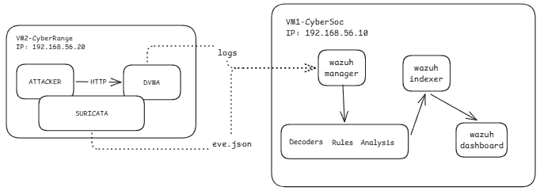

# :shield: Laboratorio SOC — Wazuh, Suricata, Threat Intelligence, YARA y FIM

Aca documentaremos la implementacion práctica del laboratorio SOC.

Objetivo es construir y validar un flujo completo de detección e investigación utilizando **Wazuh**, **Suricata**, **Threat Intelligence**, **YARA** y **FIM**, iniciaremos con la preparacion de la infra hasta la observacion de las alertas generadas desde la maquina atacante a la maquina vulnerable.

> :warning: **Entorno de laboratorio**
>
> Crearemos un entorno controlado. DVWA es una aplicación vulnerable y no debe exponerse directamente a Internet.

---

## :dart: Objetivo del laboratorio

Terminando el laboratorio habre construido un flujo:

1. Preparacion de red entre maquinas virtuales.
2. Configuracion de Wazuh como SIEM.
3. Implementacion de Suricata como NIDS.
4. Se genera tráfico controlado contra DVWA.
5. Suricata inspecciona el tráfico y genera eventos en formato eve.json.
6. Wazuh Agent recopila esos eventos.
7. Wazuh Manager procesa y genera alertas.
8. Threat Intelligence permite enriquecer eventos mediante una CDB List.
9. YARA analiza archivos en busca de patrones definidos.
10. FIM registra modificaciones en el directorio de evidencias.
11. Threat Hunting permite relacionar las diferentes evidencias durante la investigación.

---

# :building_construction: Arquitectura del laboratorio

El laboratorio está compuesto por dos máquinas virtuales conectadas mediante una red NAT de VMware.

```text

RED NAT VMWARE: 192.168.56.0/24
   ├──VM1 - CYBERSOC: 192.168.56.10
   |   ├──WAZUH MANAGER
   |   ├──WAZUH INDEXER
   |   ├──WAZUH DASHBOARD
   |
   ├──VM2 - CYBERRANGE: 192.168.56.20
   |   ├──WAZUH AGENT
   |   ├──SURICATA
   |   ├──DOCKER
   |      ├──BR-CYBERSOC: 172.30.0.0/24
   |         ├──DVWA : 172.30.0.10
   |         ├──ATTACKER: 172.30.0.20
```

---

## :computer: VM1 — CyberSOC

**Dirección IP:**

```text
192.168.56.10
```

Maquina que aloja:

* Wazuh Manager
* Wazuh Indexer
* Wazuh Dashboard

Wazuh se ejecuta mediante Docker utilizando la versión:

```text
Wazuh 4.14.7
```

Directorio utilizado:

```text
/opt/wazuh-docker/single-node
```

Dashboard:

```text
https://192.168.56.10
```

---

## :computer: VM2 — CyberRange

**Dirección IP:**

```text
192.168.56.20
```
Esta maquinca generará le trafico, deteccion y recolección de eventos.

Contiene:

* Wazuh Agent
* Suricata
* Docker
* DVWA
* Attacker

Directorio principal del laboratorio Docker:

```text
/opt/cybersoc-lab
```

---

# :globe_with_meridians: Redes utilizadas

Utilizamos dos redes diferentes.

## :satellite: Red VMware

Las dos maquinas virtuales por medio de una red NAT:

Rango:
```text
192.168.56.0/24
```

Direcciones utilizadas:

```text
VM1 → 192.168.56.10
VM2 → 192.168.56.20
```

Esta red permite la comunicación entre el Wazuh Agent de VM2 y los componentes centrales de Wazuh ubicados en VM1.

La configuración y validación de esta red se realizará en:

➡️ [01-preparacion-del-entorno.md](./01-preparacion-del-entorno.md)

---

## :whale: Red Docker

Dentro de VM2 existe una segunda red independiente:

```text
172.30.0.0/24
```

La red Docker utiliza:

```text
Network: cybersoc_lab
Bridge:  br-cybersoc
```

Contenedores:

```text
DVWA
172.30.0.10

Attacker
172.30.0.20
```


---

# :arrows_counterclockwise: Flujo general del laboratorio

El flujo principal de detección comienza con el tráfico generado por el contenedor atacante.



---

# :mag: Flujo de enriquecimiento e investigación

El flujo de detección se amplía posteriormente con Threat Intelligence, YARA y FIM.

```text
                         ┌─────────────────────┐
                         │   Threat Intelligence│
                         │      CDB List        │
                         └──────────┬──────────┘
                                    │
                                    ▼
Attacker → DVWA → Suricata → eve.json → Wazuh Agent
                                             │
                                             ▼
                                      Wazuh Manager
                                             │
                                             ▼
                                    Correlación / Rules
                                             │
                              ┌──────────────┴──────────────┐
                              │                             │
                              ▼                             ▼
                       TI / IOC Match                Alertas Wazuh
                              │
                              ▼
                       Investigación
                              │
                    ┌─────────┴─────────┐
                    │                   │
                    ▼                   ▼
                  YARA                 FIM
                    │                   │
                    └─────────┬─────────┘
                              ▼
                         Evidencias
                              │
                              ▼
                       Threat Hunting
```

---

# :wrench: Etapas del laboratorio

Dividimos el laboratorio en etapas.

## 1. :gear: Preparación del entorno

Archivo:

➡️ [01-preparacion-del-entorno.md](./01-preparacion-del-entorno.md)

Preparacion de la infraestructura que usaremos en el laboratorio.

**Punto de partida del laboratorio.**

---

## 2. :shield: Wazuh

Archivo:

➡️ [02-wazuh.md](./02-wazuh.md)

Praparacion de Wazuh.


---

## 3. :satellite: Suricata

Archivo:

➡️ [03-suricata.md](./03-suricata.md)

En esta etapa se implementa Suricata como NIDS dentro de VM2.

Se documentará:

* Instalación de Suricata.
* Configuración de `HOME_NET`.
* Configuración de la interfaz `br-cybersoc`.
* Generación de eventos EVE JSON.
* Creación de la regla local.
* SID `1000001`.
* Generación de tráfico desde el atacante.
* Validación de la alerta en `eve.json`.
* Integración de los eventos con Wazuh.

Regla utilizada:

```text
SID: 1000001
CYBERSOC - Acceso HTTP a DVWA
```

---

## 4. :mag: Threat Intelligence

Archivo:

➡️ [04-threat-intelligence.md](./04-threat-intelligence.md)

En esta etapa se incorpora contexto de Threat Intelligence a los eventos recibidos por Wazuh.

Se documentará:

* Creación y utilización de la CDB List.
* Archivo:

```text
/var/ossec/etc/lists/threat-intel-ip
```

* Formato `IP:label`.
* Coincidencia del IOC.
* Regla personalizada de Wazuh `100500`.
* Priorización de la alerta.
* Validación del enriquecimiento en Wazuh.

La regla `100500` pertenece a Wazuh y es diferente del SID `1000001` utilizado por Suricata.

---

## 5. :mag_right: YARA

Archivo:

➡️ [05-yara.md](./05-yara.md)

En esta etapa se implementa YARA para analizar archivos de evidencia.

Directorio utilizado:

```text
/opt/cybersoc-hunting/evidence
```

Se documentará:

* Preparación de las evidencias.
* Creación de las reglas YARA.
* Patrones utilizados.
* Ejecución periódica mediante `systemd timer`.
* Generación del log:

```text
/var/log/cybersoc-yara.log
```

* Integración de los resultados con Wazuh.
* Regla personalizada `100600`.

---

## 6. :page_facing_up: FIM

Archivo:

➡️ [06-fim.md](./06-fim.md)

En esta etapa se configura File Integrity Monitoring mediante Wazuh Syscheck.

Se monitorizará:

```text
/opt/cybersoc-hunting/evidence
```

Se documentará:

* Configuración de Syscheck.
* Monitorización en tiempo real.
* Detección de creación de archivos.
* Detección de modificaciones.
* Detección de eliminaciones.
* Validación de los eventos generados.

Un cambio detectado por FIM representa una evidencia que debe ser analizada; no implica por sí mismo que el archivo sea malicioso.

---

## 7. :detective: Threat Hunting

Archivo:

➡️ [07-threat-hunting.md](./07-threat-hunting.md)

Esta etapa reúne las evidencias generadas durante el laboratorio para realizar una investigación.

Se documentará:

* Búsqueda de alertas.
* Correlación de eventos.
* Análisis de Threat Intelligence.
* Revisión de resultados de YARA.
* Revisión de eventos FIM.
* Relación entre las diferentes evidencias.
* Investigación desde Wazuh Dashboard.

El objetivo es pasar de eventos individuales a una investigación basada en evidencias.

---

# :triangular_flag_on_post: Indicadores y reglas utilizadas

Durante el laboratorio se utilizan diferentes identificadores.

Es importante no confundirlos:

| Identificador | Plataforma | Función                                       |
| ------------- | ---------- | --------------------------------------------- |
| `1000001`     | Suricata   | Regla local para detectar acceso HTTP a DVWA  |
| `86601`       | Wazuh      | Regla base utilizada para eventos de Suricata |
| `100500`      | Wazuh      | Regla personalizada para Threat Intelligence  |
| `100600`      | Wazuh      | Regla personalizada para resultados de YARA   |

Estos identificadores pertenecen a componentes diferentes del laboratorio y se documentarán en las etapas correspondientes.

---

# :round_pushpin: Estado esperado al finalizar

Al completar todas las etapas, el laboratorio deberá permitir reproducir el siguiente escenario:

```text
                    GENERACIÓN
                        │
                        ▼
                 Attacker / DVWA
                        │
                        ▼
                    Suricata
                        │
                        ▼
                  EVE JSON
                        │
                        ▼
                  Wazuh Agent
                        │
                        ▼
                 Wazuh Manager
                        │
             ┌──────────┼──────────┐
             │          │          │
             ▼          ▼          ▼
             TI        FIM        YARA
             │          │          │
             └──────────┼──────────┘
                        ▼
                   Investigación
                        │
                        ▼
                  Threat Hunting
                        │
                        ▼
                 Wazuh Dashboard
```

---

# :white_check_mark: Validación final

Al terminar el laboratorio se deberá poder comprobar como mínimo:

```text
- VM1 y VM2 tienen conectividad
- Wazuh Manager está operativo
- Wazuh Indexer está operativo
- Wazuh Dashboard responde por HTTPS
- El agente cyberrange-suricata está conectado
- La red Docker cybersoc_lab existe
- Existe el bridge br-cybersoc
- DVWA utiliza 172.30.0.10
- Attacker utiliza 172.30.0.20
- DVWA responde desde el contenedor atacante
- Suricata inspecciona br-cybersoc
- eve.json recibe eventos
- La regla Suricata 1000001 genera una alerta
- Wazuh recibe los eventos de Suricata
- Threat Intelligence puede enriquecer los eventos
- La regla Wazuh 100500 procesa el IOC
- YARA analiza el directorio de evidencias
- FIM monitoriza el directorio de evidencias
- Los resultados pueden utilizarse durante Threat Hunting
```

---

## :arrow_forward: Siguiente paso

Arranquemos con el siguiente paso.

➡️ [01-preparacion-del-entorno.md](./01-preparacion-del-entorno.md)

Abarcaremos la infraestructura, comenzamos por la configuracion Nat y preparacion de las dos maquinas virtuales