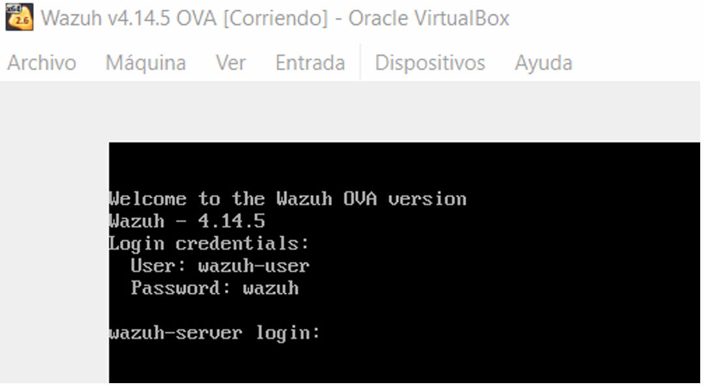
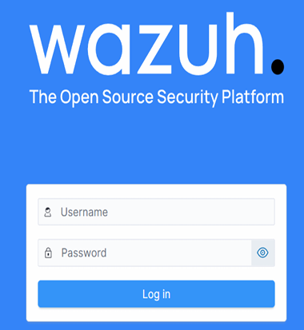
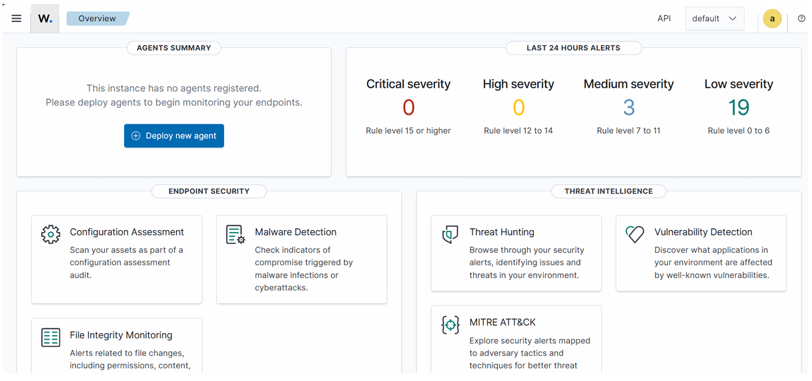
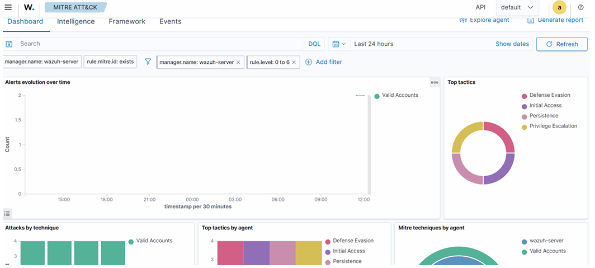
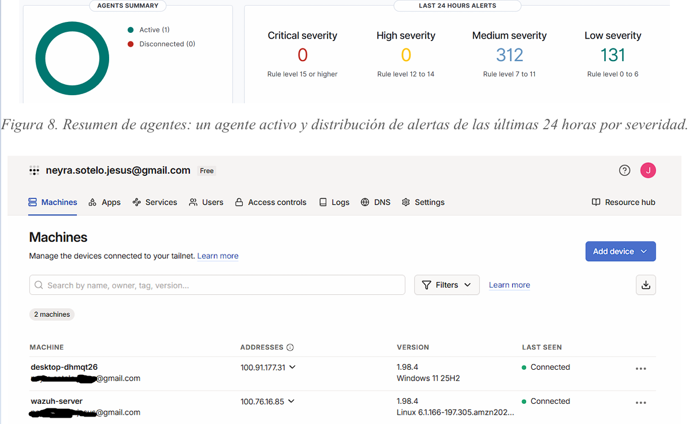
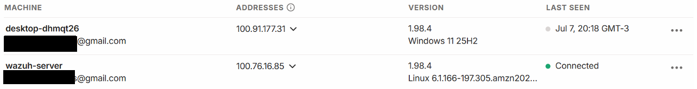
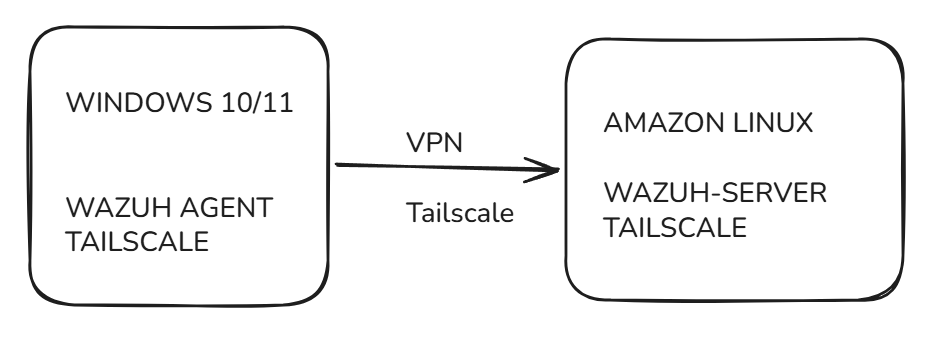
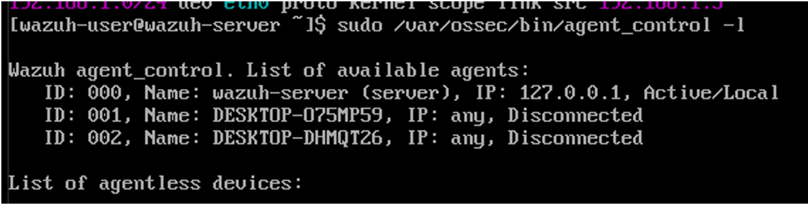

# 🛡️ Laboratorio SIEM: Despliegue de Wazuh y Monitoreo Remoto con Tailscale

**Versión:** 1.0  
**Tecnologías:** Wazuh (4.14.5), Amazon Linux 2023, Oracle VirtualBox (o equivalente), Tailscale.

## 📌 1. Introducción y Objetivo

Este proyecto documenta el despliegue de un entorno de laboratorio basado en **Wazuh**, una plataforma SIEM (*Security Information and Event Management*) y XDR de código abierto. Está orientada a la detección de amenazas, monitoreo de integridad de archivos, evaluación de configuración y análisis de vulnerabilidades.

**Objetivos principales:**
1. Desplegar un servidor Wazuh a partir de una imagen OVA preconfigurada y registrar un primer agente en la red local.
2. Extender la arquitectura para monitorear dispositivos ubicados **fuera de la red local** sin necesidad de abrir puertos en el router o configurar reglas NAT, implementando una VPN de malla (*mesh VPN*) basada en **Tailscale**.

---

## 🏗️ 2. Arquitectura

El entorno se divide en dos roles principales: el servidor principal (Manager) y los agentes (Endopoints). La comunicación remota se asegura a través de un túnel VPN de Tailscale para evitar exponer los servicios de Wazuh a Internet.

### 2.1 Servidor (Wazuh Manager)
* **Sistema:** Amazon Linux 2023 (v4.14.5) sobre appliance OVA.
* **IP Local Fija:** `192.168.1.5` (Gateway: `192.168.1.1`).
* **Red VPN (Tailscale):** Instalado y autenticado (Ej. IP asignada: `100.76.16.85`).

### 2.2 Agente (Endpoint Monitoreado)
* **Sistema Operativo:** Windows 10/11 (Aplicable a Linux/macOS).
* **Red VPN (Tailscale):** Autenticado con la misma cuenta del servidor.
* **Wazuh Agent:** Apuntando a la IP del servidor. 
  > **Nota:** La instalación del agente es idéntica tanto en entorno local como remoto; únicamente cambia la `Wazuh Manager Address` configurada (IP Local vs. IP Tailscale).

---

## ⚙️ 3. Requisitos Previos

### Hardware y Software
| Recurso | Valor Recomendado |
| :--- | :--- |
| **Memoria RAM** | 8 - 16 GB |
| **Almacenamiento** | 50 GB o más |
| **Formato de Imagen** | OVA (*Open Virtual Appliance*) |
| **Sistema Base** | Amazon Linux 2023 (64-bit, x86_64/AMD64) |
| **Hipervisor** | Oracle VirtualBox (o equivalente) |

### Configuración de la Máquina Virtual (VirtualBox)
* **General:** Habilitar *Portapapeles* y *Drag-and-Drop* en modo Bidireccional.
* **Sistema:** Asignar `8192 MB` de RAM.
* **Pantalla:** Controlador gráfico `VMSVGA`.
* **Red:** Adaptador en modo **Adaptador Puente** (*Bridge Adapter*) para obtener una IP en el mismo segmento de la red física.

---

## 🚀 4. Despliegue de Wazuh (OVA)

Este formato OVA simplifica el despliegue al incluir los componentes de Wazuh (Manager, Indexer, Dashboard) ya preconfigurados, minimizando errores.

1. **Descarga de la imagen oficial:**  
   [Enlace oficial Wazuh 4.14.5 OVA](https://packages.wazuh.com/4.x/vm/wazuh-4.14.5.ova)

2. **Primer arranque y credenciales CLI:**  
   Una vez importada la VM, inicia el sistema e ingresa con las credenciales por defecto de la consola (SSH/Terminal):
   * **Usuario:** `wazuh-user`
   * **Contraseña:** `wazuh`

   


---

## 🌐 5. Acceso al Dashboard

### 5.1 Identificación de la IP del Servidor
Dentro de la CLI, verificamos la dirección IP asignada a la interfaz de red (ej. `eth0`):
```bash
ip a
```
*(Asumiremos que la IP asignada es `192.168.1.101` para este ejemplo)*.

### 5.2 Acceso Web
Abre un navegador web en tu equipo anfitrión y navega a:  
`https://192.168.1.101`

Utiliza las credenciales por defecto del panel web:
* **Usuario:** `admin`
* **Contraseña:** `admin`

> ⚠️ **RECOMENDACIÓN** Estas credenciales `admin/admin` deben ser modificadas en un entorno de producción pero para este caso lo dejaremos por defecto.



---

## 📊 6. Exploración y Monitoreo

### Vista General (Overview)
El dashboard nos muestra una vista rápida de agentes registrados, alertas de las últimas 24 horas por severidad y acceso a módulos críticos: evaluación de configuración, *Threat Hunting*, integridad de archivos, entre otros.

### Módulo MITRE ATT&CK
Permite correlacionar las alertas con las TTP usadas por el adversario. Muestra la evolución temporal, tácticas más frecuentes y técnicas empleadas por agente. Es fundamental para interpretar el tipo de ataque y plantear estrategias de mitigación.

 

---

## 💻 7. Incorporación de Agentes (Windows)

Desde el panel principal, dirígete a **Agents** y selecciona **Deploy new agent**. El asistente generará los comandos necesarios.

1. **Configuración del asistente:**
   * **OS:** Windows (MSI)
   * **Server Address:** `192.168.1.101` (o la IP de Tailscale si el equipo es externo).

2. **Ejecución en el Endpoint (PowerShell como Administrador):**

```powershell
# 1. Descargar e instalar el agente (el comando variará según el token y tu IP)
Invoke-WebRequest -Uri https://packages.wazuh.com/4.x/windows/wazuh-agent-4.14.5-1.msi -OutFile ${env:tmp}\wazuh-agent; msiexec.exe /i ${env:tmp}\wazuh-agent /q WAZUH_MANAGER='192.168.1.101' WAZUH_REGISTRATION_SERVER='192.168.1.101'

# 2. Iniciar el servicio del agente
NET START WazuhSvc
```

Una vez iniciado, el agente se mostrará en la lista de dispositivos activos dentro del Dashboard, comenzando el envío de telemetría y eventos de seguridad al instante.



---

## :hammer_and_wrench: 8. Troubleshooting
**Fijación de la dirección IP del servidor**
    Durante las pruebas se detectó que la IP del servidor Wazuh, al ser asignada por (DHCP), cambiaba entre reinicios.
    Esto genera un gran problema ya que nos obligaría a modificar manualmente el 
    archivo de configuración ossec.conf en cada uno de los dispositivos ya conectados de forma local cada vez que la IP del servidor cambiara.
    La mejor solucion fue asignar la direccion IP dejandola estática.

1. **Identificación del rango de red**
    Antes de asignar una IP fija, debemos conocer el gateway de la red para no generar conflictos: 
        - En Windows: ejecutar ipconfig y localizar la dirección del gateway. 
        - En Linux: ejecutar ifconfig (o ip a) para obtener la misma información. 
    Con el gateway identificado, se conoce el rango de direcciones disponible en la red local. 

2. **Configuración de la interfaz de red en el servidor**
    # 1. Dentro de la VM del servidor Wazuh, se identifica primero la interfaz de red activa:
    ```bash
    ip a 
    # Interfaz identificada en este caso: eth0 (puede variar: ens33, etc.)
    ``` 
    # 2. Se verifica la configuración actual de la interfaz:
    ```bash
    cat /etc/sysconfig/network-scripts/ifcfg-eth0
    ```
    # 3. Y se edita el archivo con privilegios de administrador:
    ```bash
    sudo nano /etc/sysconfig/network-scripts/ifcfg-eth0
    ```
    # 4. Con el siguiente contenido, ajustando IPADDR al valor deseado dentro del rango detectado: 
    ```bash
    DEVICE=eth0 
    BOOTPROTO=none 
    ONBOOT=yes 
    TYPE=Ethernet 
    
    IPADDR=192.168.1.*        # fijamos la ip estática 
    PREFIX=24 
    GATEWAY=192.168.1.1 
    DNS1=192.168.1.1 
    
    USERCTL=yes 
    PEERDNS=yes 
    DHCPV6C=yes 
    DHCPV6C_OPTIONS=-nw 
    PERSISTENT_DHCLIENT=yes 
    RES_OPTIONS="timeout:2 attempts:5"
    ```
    # 5. Finalmente, se reinicia el servicio de red para aplicar los cambios y se verifica el resultado:
    ```bash
    sudo systemctl restart network 
    ip a   # Verifica que la IP fija se haya aplicado correctamente
    ```
>[!TIP] 
>Fijar la IP del servidor evita tener que reconfigurar el archivo ossec.conf de
>todos los agentes locales cada vez 
>que se reinicia el servidor Wazuh, aportando estabilidad al entorno de
>laboratorio. 

---

## 9. Preparación del entorno para dispositivos fuera de la red 🌍

Para monitorear dispositivos que no se encuentran en la misma red local, se optó por **Tailscale**, una VPN de malla (*mesh VPN*) basada en WireGuard. Su principal ventaja para este laboratorio es que no requiere abrir puertos en el router, no exige modificar su configuración, y no depende de reglas de NAT, ya que la conectividad se resuelve mediante la propia infraestructura de Tailscale.

### 1 Instalación de Tailscale en el servidor Wazuh

Sobre la máquina virtual (VM) del servidor Wazuh se instala el cliente de Tailscale ejecutando el siguiente comando:

```bash
curl -fsSL [https://tailscale.com/install.sh](https://tailscale.com/install.sh) | sh
```

se habilita e inicia el servicio
```bash
sudo systemctl enable --now tailscaled
sudo tailscale up
```

El comando tailscale up genera una URL de autenticación (por ejemplo, https://login.tailscale.com/a/xxxxxxxxxxxx), que debe abrirse en un navegador web para vincular el dispositivo a tu cuenta de Tailscale.

[!IMPORTANT]
Nota sobre la cuenta a utilizar:
Es altamente recomendable utilizar una cuenta personal de Tailscale y no una cuenta institucional o educativa. Si la cuenta institucional se da de baja o pierde el acceso, se perderá la conexión y el servicio deberá vincularse nuevamente ejecutando sudo tailscale up para generar una nueva URL de autenticación.

Una vez autenticado el servidor, se obtiene la dirección IP asignada dentro de la red privada de Tailscale mediante el comando:
```bash
tailscale ip -4 
# Ejemplo de salida: 100.76.16.85
```
Esta dirección IP —perteneciente al rango 100.x.x.x de Tailscale— es la que utilizarán los agentes remotos 
para comunicarse con el servidor Wazuh. 

### 2 Instalación de Tailscale en el equipo a monitorear
El mismo cliente de Tailscale debe instalarse en cada equipo que actuará como agente remoto (por ejemplo, un equipo Windows), iniciando sesión con la misma cuenta utilizada en el servidor. 
Una vez vinculado, se puede verificar la conectividad VPN entre ambos extremos ejecutando, desde el equipo 
`````powershell
ping 100.76.16.85 
`````

Una respuesta correcta confirma que existe conectividad VPN entre el agente y el servidor, incluso si ambos se 
encuentran en redes físicas completamente distintas. 



---
## 10. Conexión de un agente remoto mediante VPN Tailscale

### 1 Objetivo

Conectar un equipo **Windows** al servidor **Wazuh** utilizando la VPN de **Tailscale** como canal de comunicación, permitiendo el intercambio de datos entre ambos dispositivos sin necesidad de exponer puertos en Internet ni depender de que se encuentren en la misma red local.

### 2 Arquitectura del escenario remoto

#### Servidor

- **Wazuh Server** instalado sobre Amazon Linux 2023.
- **Dirección IP local:** `192.168.1.5`
- **Gateway:** `192.168.1.1`
- **Tailscale:** instalado y autenticado.

#### Agente

- **Windows 10/11.**
- **Tailscale:** instalado y autenticado con la misma cuenta que el servidor.
- **Wazuh Agent:** instalado y configurado para apuntar a la IP de Tailscale del servidor.



### 3 Verificación de conectividad previa

Antes de instalar el agente, conviene validar que el servidor tenga salida a Internet y que Tailscale esté operativo:

```bash
ping -c 4 google.com
```

Verifica conectividad a Internet.

```bash
tailscale status
```

Verifica el estado de la conexión Tailscale.

```bash
tailscale ip -4
```

Obtiene la IP de Tailscale del servidor.

### 4 Instalación del agente Wazuh sobre el equipo remoto

Desde el dashboard de Wazuh: **Agents → Deploy New Agent**, seleccionando:

- **Sistema operativo:** Windows
- **Wazuh Manager Address:** la IP de Tailscale del servidor (ej. `100.76.16.85`)

El dashboard genera automáticamente el comando de instalación correspondiente, por ejemplo:

```powershell
Invoke-WebRequest -Uri https://packages.wazuh.com/4.x/windows/wazuh-agent-4.14.5-1.msi `
  -OutFile $env:TEMP\wazuh-agent.msi

msiexec.exe /i $env:TEMP\wazuh-agent.msi /q `
  WAZUH_MANAGER="100.76.16.85"
```

### 5 Inicio del servicio del agente

Finalizada la instalación, se inicia el servicio del agente en PowerShell (con permisos de administrador):

```powershell
NET START WazuhSvc
```

Y se verifica su estado:

```powershell
Get-Service WazuhSvc
```

**Resultado esperado:**

```text
Status : Running
```
---

## 11. Verificación del registro del agente

### 1 Desde el equipo Windows

```powershell
sc query WazuhSvc
```

### 2 Desde el servidor Wazuh

Listado de agentes registrados:

```bash
sudo /var/ossec/bin/agent_control -l
```

### 3 Desde el dashboard

En la sección **Agents**, el nuevo equipo remoto debe figurar con estado **Active**, confirmando que la comunicación a través del túnel de Tailscale funciona correctamente.

---

## 12. Comprobaciones de diagnóstico

### 1 Estado de Tailscale

#### En el servidor

```bash
tailscale status
```

#### En el cliente

```powershell
ping 100.76.16.85
```

### 2 Puertos de Wazuh en el servidor

Wazuh utiliza el puerto `1514` (recepción de eventos) y el puerto `1515` (registro de agentes). Su estado puede verificarse con:

```bash
sudo ss -tulpn | grep 1514
```

```bash
sudo ss -tulpn | grep 1515
```

### 3 Logs del agente

En caso de fallas de conexión o registro, el primer punto de revisión es el log local del agente en Windows:

```text
C:\Program Files (x86)\ossec-agent\logs\ossec.log
```

---

## 13. Conclusiones

El uso de un OVA preconfigurado permitió reducir significativamente la complejidad inicial del despliegue de Wazuh, dando una primer experiencia o primer contacto con una herramienta como WAZUH, el explorar diferentes modulos y ver el dashboard como esta compuesto

La incorporación de Tailscale como capa de conectividad demostró ser una alternativa simple y segura para extender el monitoreo a dispositivos fuera de la red local, evitando la exposición de servicios a Internet y la necesidad de reconfigurar el router. Combinado con la fijación de una IP estática en el servidor, el entorno resultante es estable y reproducible para futuras prácticas de laboratorio.
